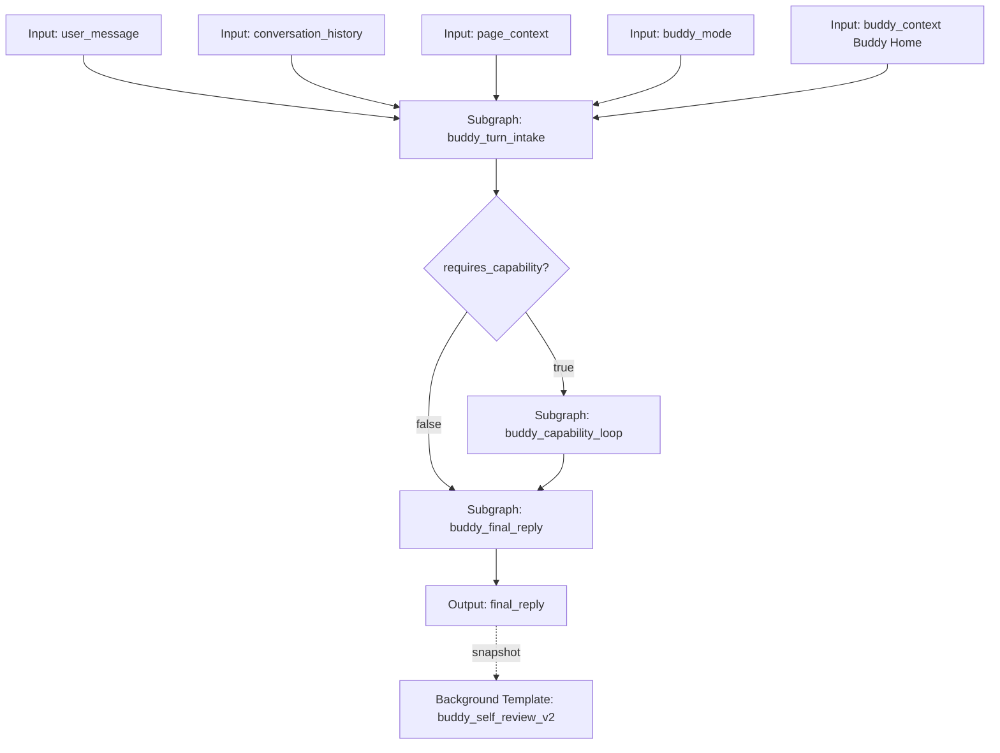
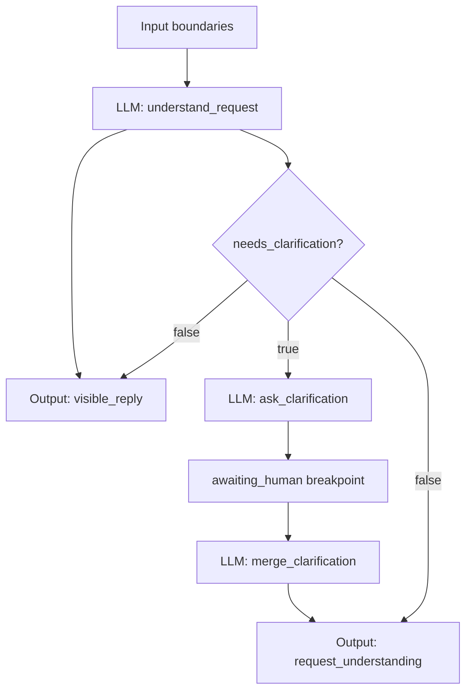
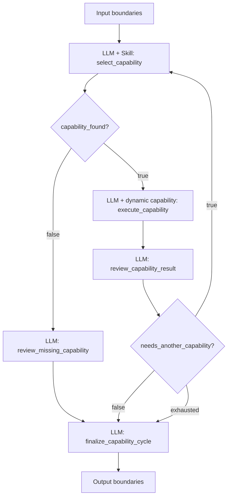
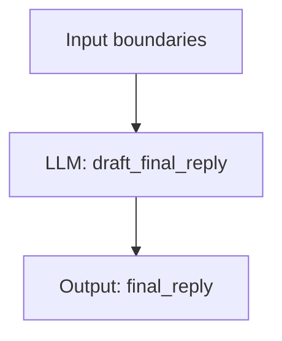
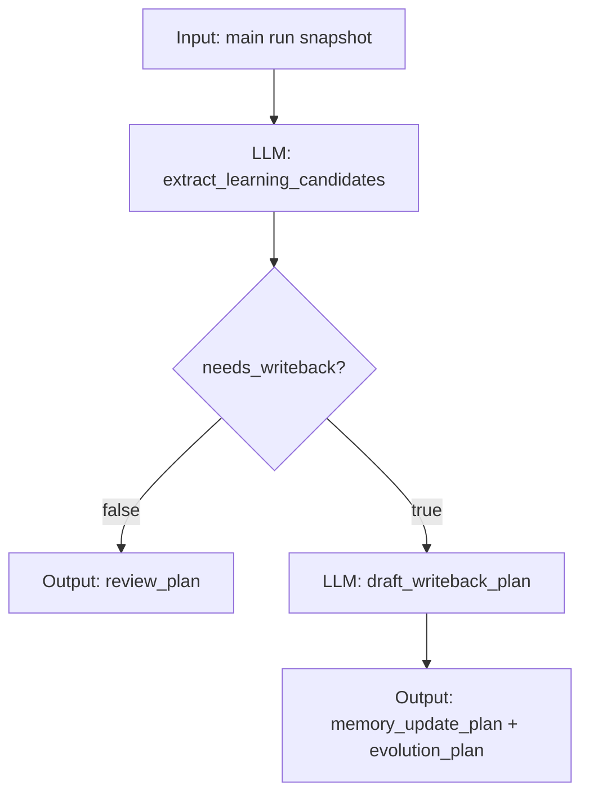
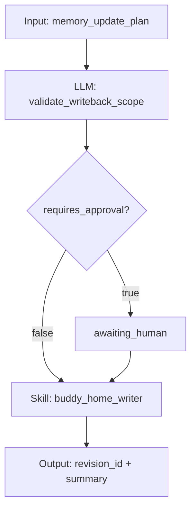

# 伙伴 Agent 循环图模板搭建报告

本文把 `demo/hermes-agent/` 和 `demo/claude-code-source/` 的可借鉴机制合并成 TooGraph 伙伴 Agent 循环的目标图模板设计。这里的“Agent 循环”不是一个隐藏后端 while-loop，而是一张由输入、LLM 节点、条件节点、Skill、动态 Subgraph、暂停、输出和后台复盘组成的图。

本报告不写代码，目标是明确下一版伙伴循环模板应该怎么搭建，以及当前图系统还缺哪些能力。

## 设计目标

伙伴收到一条用户消息后，目标体验应该是：

1. 用户消息立刻进入当前会话，并创建一条与之配对的助手消息和 run capsule。
2. 助手消息很快显示 `visible_reply`，说明 Buddy 已理解请求或正在准备下一步。
3. 后续上下文整理、能力选择、Skill/Subgraph 执行、权限审批、工具进度、结果复盘都作为同一个 run 的活动事件持续展示。
4. 一轮用户消息最终只产生一个面向用户的 `final_reply`。
5. 最终回复完成后，后台自我复盘另起一个内部图，不阻塞用户下一条消息。
6. 所有循环、重试、审批、暂停、继续和最终收束都在图模板或运行协议里表达，不藏在 Buddy 专用 endpoint 里。

核心约束仍然是：

- 整张图才是 Agent。
- LLM 节点只做一次模型调用。
- 一个 LLM 节点最多使用一个显式能力来源：无能力、一个静态 Skill，或一个输入 `capability` state。
- Skill 只做一次受控能力调用，不拥有多步自治、最终回复生成或长期记忆策略。
- 多步能力循环必须由图节点、条件边、state 和 loop limit 表达。

## 两个参考项目的优点合并

### Hermes Agent 值得借鉴的点

Hermes 的强项是完整自治 turn：

- 入口层先处理鉴权、命令、附件、`@` 引用、会话恢复和运行中输入，不把所有内容都直接丢给模型。
- Agent 主循环反复执行“上下文 -> 模型 -> 工具 -> 工具结果 -> 模型”，直到得到最终文本。
- 工具执行前有参数校验、工具名修复、guardrail、危险操作审批、checkpoint 和进度回调。
- 运行中新输入有 queue、steer、interrupt 三种语义。
- 超时是“无活动超时”，不是固定整轮时长。
- 最终回复完成后启动后台 memory/skill review，不阻塞当前用户 turn。
- `delegate_task` 证明复杂子任务可以被视为一种能力调用，并把子任务结果回填给父循环。

TooGraph 应借鉴这些产品机制，但不要复制 Hermes 的隐藏 Python Agent 类。

### Claude Code 值得借鉴的点

Claude Code 的强项是事件化和快速反馈：

- REPL 先把用户消息加入 UI，再准备模型和工具调用。
- 核心 `query()` 是 async generator，模型流、工具进度、错误、tombstone 和最终消息都增量产出。
- 模型输出 `tool_use` 后，工具结果以 `tool_result` 回填，再进入下一轮模型调用。
- 权限是 runtime 决策，不是 prompt 里的软约束。
- headless/SDK 路径会在模型响应前先持久化 accepted user message，保证中途退出后可恢复。
- transcript、progress、run event 分层，不把高频临时流式状态直接混进长期记忆。

TooGraph 应借鉴它的“先显示、持续流、可恢复”，但仍要把节点、能力和 state 留在图协议中。

## 目标模板总览

建议把下一版伙伴可见主模板称为 `buddy_autonomous_loop_v2`。它可以从现有 `buddy_autonomous_loop` 演进，而不是推倒重来。

顶层只保留用户能理解的稳定阶段：



这张顶层图应该只承担编排职责，不把能力循环内部细节铺满主画布。

### 顶层节点表

| 节点 | 类型 | 作用 | 是否子图 |
| --- | --- | --- | --- |
| `input_user_message` | input | 本轮用户消息 | 否 |
| `input_conversation_history` | input | 本会话最近历史或摘要 | 否 |
| `input_page_context` | input | 当前页面、图、节点、选区、运行详情等上下文 | 否 |
| `input_buddy_mode` | input | `ask_first` 或 `full_access` | 否 |
| `input_buddy_context` | input | Buddy Home 文件夹选择包 | 否 |
| `buddy_turn_intake` | subgraph | 请求理解、即时可见回复、必要澄清 | 是 |
| `needs_capability` | condition | 根据 `request_understanding.requires_capability` 分流 | 否 |
| `buddy_capability_loop` | subgraph | 能力选择、执行、复盘、循环 | 是 |
| `buddy_final_reply` | subgraph | 汇总最终回复 | 是 |
| `output_final` | output | 只展示 `final_reply` | 否 |

### 顶层 state 契约

| state | 类型 | 写入者 | 读取者 | 说明 |
| --- | --- | --- | --- | --- |
| `user_message` | text | input | intake、capability loop、final | 原始用户消息 |
| `conversation_history` | markdown | input | intake、final、self-review | 最近对话，不是系统指令 |
| `page_context` | markdown | input | intake、capability loop、final | 页面上下文 |
| `buddy_mode` | text | input | intake、runtime metadata | 权限模式 |
| `buddy_context` | file | input | intake、capability loop、final、self-review | Buddy Home 选中文件 |
| `visible_reply` | markdown | intake | Buddy UI | 早期可见回复，不等于最终完成 |
| `request_understanding` | json | intake | condition、capability loop、final | 请求结构化理解 |
| `selected_capability` | capability | capability loop | execute capability | 单个动态能力 |
| `capability_found` | boolean | capability loop | final | 是否找到能力 |
| `capability_result` | result_package | capability loop | review、final | 动态能力结果包 |
| `capability_review` | json | capability loop | loop condition、final、self-review | 执行复盘和下一步判断 |
| `capability_gap` | json | capability loop | final | 能力缺口 |
| `capability_trace` | json | capability loop | final、self-review | 能力调用摘要列表 |
| `final_reply` | markdown | final | output、chat history | 唯一最终回复 |

可选新增 state：

| state | 类型 | 目的 |
| --- | --- | --- |
| `turn_policy` | json | 本轮可用权限、预算、是否允许排队/中断/后台复盘 |
| `run_budget` | json | 最大能力轮数、上下文预算、无活动超时策略 |
| `clarification_prompt` | markdown | 澄清暂停卡片展示内容 |
| `clarification_answer` | markdown | 用户在暂停卡片内补充的内容 |
| `activity_summary` | json | 低层活动事件的摘要索引，正式实现后可由 runtime 维护 |

## 子图一：`buddy_turn_intake`

这是一个完整模块，值得封装成子图。它把杂乱输入变成结构化请求理解，同时负责让用户尽快看到 Buddy 的第一段可见回应。

### 输入

- `user_message`
- `conversation_history`
- `page_context`
- `buddy_mode`
- `buddy_context` 可选。如果该子图只做轻量理解，可以不读全文 Buddy Home，只读必要 persona/policy 摘要。

### 输出

- `visible_reply`
- `request_understanding`
- `clarification_prompt` 可选

### 内部流程



### 节点契约

| 节点 | 类型 | LLM 调用 | Skill | reads | writes |
| --- | --- | --- | --- | --- | --- |
| `understand_request` | LLM | 1 次 | 无 | 用户消息、历史、页面上下文、模式 | `visible_reply`、`request_understanding` |
| `need_clarification` | condition | 0 次 | 无 | `request_understanding` | 分支 |
| `ask_clarification` | LLM | 1 次 | 无 | 用户消息、请求理解 | `clarification_prompt` |
| `merge_clarification` | LLM | 1 次 | 无 | 用户消息、请求理解、澄清问题、用户回答 | `request_understanding` |

### `request_understanding` 建议结构

```json
{
  "intent": "chat | answer | research | edit_file | run_command | graph_edit | create_skill | memory_update | automation",
  "user_goal": "一句话目标",
  "known_inputs": ["已经明确的信息"],
  "missing_information": ["缺失但会影响执行的信息"],
  "needs_clarification": false,
  "clarification_focus": "",
  "requires_capability": true,
  "direct_answer_possible": false,
  "risk_level": "low | medium | high",
  "expected_side_effects": ["none | file_read | file_write | subprocess | graph_edit | memory_write | network"],
  "success_criteria": ["本轮完成标准"],
  "response_contract": {
    "should_show_visible_reply": true,
    "final_reply_style": "concise | detailed | step_by_step"
  }
}
```

### 必须修正的暂停语义

澄清暂停不能只靠“下游节点读取 `clarification_answer` 但没人写它”。它必须是协议化暂停：

- 子图内部 graph metadata 应声明 `interrupt_after: ["ask_clarification"]`。
- `ask_clarification` 完成后，run 状态进入 `awaiting_human`。
- Buddy 悬浮窗暂停卡片显示 `visible_reply`、`clarification_prompt`、当前请求理解。
- 用户只在暂停卡片内填写一个补充输入。
- resume payload 写入 `clarification_answer` 后继续到 `merge_clarification`。

当前系统支持图级 `metadata.interrupt_after` 和标准 resume，但现有模板 JSON 需要确保这一点真实存在，而不是只停留在文档意图里。

## 子图二：`buddy_capability_loop`

这是伙伴 Agent 循环的核心，必须封装成子图。它是一个完整模块：选择能力、执行一次能力、复盘结果、决定继续或收束。

### 输入

- `user_message`
- `conversation_history`
- `page_context`
- `buddy_mode`
- `buddy_context`
- `request_understanding`
- `capability_review` 可选，供下一轮选择能力时读取上一轮复盘

### 输出

- `selected_capability`
- `capability_found`
- `capability_result`
- `capability_review`
- `capability_gap`
- `capability_trace`

### 内部流程



### 内部节点契约

| 节点 | 类型 | LLM 调用 | Skill/能力 | reads | writes |
| --- | --- | --- | --- | --- | --- |
| `select_capability` | LLM | 1 次，用于生成 Skill 输入 | 静态 `toograph_capability_selector` | 用户消息、请求理解、上一轮复盘 | `selected_capability`、`capability_found` |
| `capability_found_condition` | condition | 0 次 | 无 | `capability_found` | true/false/exhausted |
| `review_missing_capability` | LLM | 1 次 | 无 | 用户消息、请求理解 | `capability_review`、`capability_gap` |
| `execute_capability` | LLM | 1 次，用于生成被选能力输入 | 输入 `selected_capability`，kind 为 skill/subgraph/none | 用户消息、页面上下文、Buddy Home、请求理解 | `capability_result` |
| `review_capability_result` | LLM | 1 次 | 无 | 用户消息、请求理解、能力结果包 | `capability_review`、append `capability_trace` |
| `continue_capability_loop` | condition | 0 次 | 无 | `capability_review.needs_another_capability` | true/false/exhausted |
| `finalize_capability_cycle` | LLM | 1 次 | 无 | found、result、review、gap、trace | 最终规整 `capability_review` |

### 关键协议边界

`execute_capability` 是动态能力执行节点，应严格遵守以下边界：

- 它读取一个 `capability` state。
- 它只写一个 `result_package` state。
- 它可以让 LLM 生成被选 Skill 或 Subgraph 的输入。
- 运行时执行能力并封装结果。
- 同一个节点不总结结果、不决定下一步、不生成最终回复。

结果复盘必须在 `review_capability_result` 节点里做。这样才符合“一个 LLM 节点一次模型回合，一个能力节点一次能力调用”的原则。

### 循环条件

`continue_capability_loop` 建议：

- `loopLimit`: 3 到 5。默认建议 3，避免 Buddy 默认对话过重。
- true 分支：回到 `select_capability`。
- false 分支：进入 `finalize_capability_cycle`。
- exhausted 分支：进入 `finalize_capability_cycle`，不视为运行失败。最终回复应说明已经达到本轮能力调用上限，并基于已有结果收束。

`capability_review` 建议结构：

```json
{
  "executed": true,
  "success": true,
  "summary": "本轮能力调用得到什么",
  "missing_information": [],
  "needs_another_capability": false,
  "next_requirement": "",
  "final_response_strategy": "answer_with_result | ask_user | offer_skill_creation | explain_failure",
  "risk_notes": [],
  "artifacts": [],
  "permission_notes": []
}
```

`capability_trace` 条目建议：

```json
{
  "round": 1,
  "capability": {
    "kind": "skill",
    "key": "web_search",
    "name": "联网搜索"
  },
  "success": true,
  "summary": "查到并保存了 4 个来源",
  "next_requirement": "",
  "duration_ms": 0,
  "artifact_refs": []
}
```

`duration_ms` 和 artifact refs 最好由 runtime 或 activity event 补齐，不应完全由 LLM 编造。

### 找不到能力时的收束

找不到能力不是异常。它应该进入 `review_missing_capability` 并输出：

```json
{
  "missing_goal": "需要什么能力",
  "available_alternatives": ["当前可做的替代路径"],
  "should_offer_build": true,
  "should_route_to_builder": false,
  "suggested_skill_or_template": {
    "kind": "skill | subgraph | template",
    "name": "建议名称",
    "reason": "为什么需要"
  }
}
```

最终回复可以问用户是否进入 `toograph_skill_creation_workflow` 或新建模板，但不能假装已经创建能力。

## 子图三：`buddy_final_reply`

这是一个完整模块，值得封装。它专门负责把请求理解、能力结果和能力轨迹变成最终用户回复。

### 输入

- `user_message`
- `conversation_history`
- `page_context`
- `buddy_context`
- `request_understanding`
- `capability_found`
- `capability_result`
- `capability_review`
- `capability_gap`
- `capability_trace`

### 输出

- `final_reply`

### 内部流程



不建议把最终回复拆成多个子节点，除非后续要引入明确的“起草 -> 校验 -> 修正”流程。当前一个 LLM 节点足够完整。

### 输出要求

`final_reply` 只包含用户该看到的内容：

- 不暴露内部 state 名称，除非路径、URL、错误原因是用户完成任务所需证据。
- 如果有能力缺口，明确说明缺什么，提供下一步选择。
- 如果执行过受控副作用，说明结果、artifact、revision 或审批状态。
- 如果循环耗尽，用已有结果收束，不把 exhausted 写成崩溃。

## 后台模板：`buddy_self_review_v2`

后台复盘不属于可见主路径。它应在 `final_reply` 完成后，从主 run snapshot 启动内部模板。



当前 `buddy_self_review` 只输出计划，这是正确边界。下一步不要让它直接静默改 Buddy Home。

如果要真正写回，应该另建受控模板：



写回模板必须返回 revision ID、diff 或 previous value reference，方便撤销。

## 不应封装成子图的东西

为了避免过度封装，以下内容不建议单独抽子图：

1. 单个 condition 节点。比如 `needs_capability` 本身只是顶层路由，留在主图更清楚。
2. 单个最终 output 节点。Output 是边界，不是业务模块。
3. 运行时权限审批。文件写入、脚本执行、删除等审批属于 runtime permission 原语，应暂停当前节点，不要做成 LLM 询问用户“你批准吗”。
4. 只有一个 LLM 节点且没有可复用边界的微流程。比如最终回复当前只需一个节点，子图是为了保持顶层一致和后续扩展，不应继续拆更小。
5. 低层活动事件。`activity_events` 是运行记录层，不应由子图伪造。
6. 模型 fallback、provider retry、stream idle watchdog。这些是 runtime primitive，不应该做成图里一堆节点。

建议封装成子图的标准：

- 有明确输入输出边界。
- 内部至少包含一个稳定的多节点流程、条件分支或暂停。
- 子图可以被 Buddy 主循环、伙伴页面或其他模板复用。
- 封装后能显著降低顶层图理解成本。

## 暂停、恢复、拒绝和取消

伙伴循环至少有四类停顿：

### 1. 澄清暂停

来源：`buddy_turn_intake.ask_clarification` 后的 `interrupt_after`。

UI 行为：

- 当前助手消息继续显示 run capsule。
- capsule 内出现暂停卡片。
- 卡片先展示已产出的 `visible_reply` 和 `clarification_prompt`。
- 只有一个补充输入区域。
- 用户提交后写入 `clarification_answer` 并 resume 原 run。

### 2. 权限审批暂停

来源：Skill 或动态 Subgraph 内部触发 risky permission，例如 `file_write`、`file_delete`、`subprocess`。

UI 行为：

- 暂停卡片展示技能名、权限类型、输入预览、风险说明、已产出上下文。
- 主按钮：执行当前方案。
- 次按钮：补充内容，写入当前 pause resume payload。
- 必须新增：拒绝本次能力。
- 必须新增：取消整轮 run。

拒绝不等于失败。拒绝应产生一个结构化 denial result，让 `review_capability_result` 能继续生成解释或替代方案。

### 3. 能力缺口收束

来源：`toograph_capability_selector` 返回 `kind=none` 或执行结果显示当前能力无法满足。

UI 行为：

- 不暂停审批。
- 最终回复里提供清楚选项：继续对话、创建 Skill、创建图模板、手工补充信息。
- 若用户选择创建能力，应启动 `toograph_skill_creation_workflow` 或图模板创建流程作为下一轮 run。

### 4. 用户运行中追加输入

应明确三种语义：

| 语义 | 适用 | UI |
| --- | --- | --- |
| queue | 用户发起新问题 | 底部输入发送后排队为下一轮 |
| supplement | 用户想补充当前 run | 当前 run capsule 内的“补充当前运行”操作 |
| interrupt | 用户想停止当前任务改问 | 当前 run capsule 内“停止并改问” |

不要出现多个并列输入框。底部输入是会话输入，暂停卡片输入是当前断点输入，二者同一时间只能有一个承担“继续当前 run”的含义。

## 悬浮窗口目标形态

为了达到 Hermes 和 Claude Code 那种“先看到回复，再看动作”的体验，伙伴悬浮窗可以大改，但应保持一个会话 lane。

### 每条助手消息都绑定 run capsule

每条用户消息创建一条助手占位消息：

```text
用户消息
伙伴消息
  - visible_reply 或 activity text
  - run capsule
      - preparing
      - intake_request
      - selecting capability
      - executing capability
      - awaiting human
      - drafting final reply
      - completed / failed / cancelled
  - final_reply
```

不要只有一个全局“当前运行过程”。历史里的每条助手消息都应该保留自己的运行过程摘要。

### run capsule 的信息层级

默认折叠，只显示：

- 当前阶段或完成摘要。
- 耗时。
- 是否等待用户。
- 最近一条 activity summary。

展开后显示：

- 节点开始/完成/失败。
- 流式输出预览。
- Skill/Subgraph 选择和结果摘要。
- 权限审批记录。
- artifact 链接。
- 子图 scope path。

### 低层活动事件

需要新增统一 `activity_events` 后，悬浮窗应显示类似：

```text
Explored 7 files
Ran python -m pytest -q, exit 0
Editing skill/user/foo/SKILL.md +84 -0
Downloaded 5 sources
Paused for file_write approval
```

这些摘要应该由 runtime、Skill、文件原语、命令原语生成，不由 LLM 编写。

### 运行时长策略

不应有固定整轮超时。应改为：

- 后端 run 有最后活动时间。
- 前端持续接收 SSE heartbeat 或轮询状态。
- 无活动超过阈值时显示“可能卡住”，允许用户取消或继续等待。
- 有活动时无限等待。
- 节点级、Skill 级和 provider 级可以有自己的 idle watchdog。

## 可以并行加速的地方

### 现在已经能做或接近能做

1. 前端预取并行：当前 Buddy 已经并行 `fetchTemplate` 和 `fetchSkillCatalog`。还可以在打开浮窗或用户输入时预取模板、Skill catalog、模型列表和 Buddy Home 摘要。
2. 后台复盘并行：`buddy_self_review` 已经在主回复完成后另起 run，不阻塞下一轮。
3. Skill 内部并行：`web_search` 下载多个来源、未来文件扫描、批量检索可以在 Skill 内部并行，但仍作为一次 Skill 调用输出结构化结果。
4. UI 流式并行：SSE、轮询、消息持久化和 run capsule 更新可以和后端执行并行。
5. 能力候选缓存：`toograph_capability_selector.before_llm.py` 读取启用模板和技能清单，可做短 TTL 缓存，避免每轮重复扫描。

### 需要运行时增强后才能做

1. 图级安全并行节点。当前 LangGraph 可以表达 DAG fanout，但 TooGraph 节点执行函数用 run-wide lock 包住了整个节点运行，实际不应假设 LLM 节点会并行执行。要真正并行，需要把状态更新、事件发布和 run store 写入拆成线程安全的短锁，并定义 state reducer。
2. 并行上下文装配。Buddy Home 摘要、页面上下文压缩、历史摘要、能力候选读取、记忆检索可以并行 fanout，然后由一个 LLM 节点合并。但这需要安全多写者和明确 merge 规则。
3. 并行只读能力。比如同时跑两个搜索子图或两个独立诊断子图。当前 `capability` state 是单个互斥对象，不支持“一个 LLM 节点返回能力列表”。若要并行，应使用固定图 fanout 或新增显式 parallel group runtime，而不是改变 `capability` 为列表。
4. 并行子任务 delegation。Hermes 的 `delegate_task` 可以启发 TooGraph 的“并行子图组”，但必须是图协议显式表达：父图有多个 Subgraph 节点或一个受控 parallel-subgraph primitive，结果汇总到一个 review LLM 节点。

### 不建议并行的地方

- `select_capability -> execute_capability -> review_capability_result` 这一条链不能并行，因为后者依赖前者结果。
- 权限审批不能绕过等待并行继续执行高风险动作。
- 同一个文件或同一张图的写入不能并行，除非先有 patch merge、conflict detection 和 revision。
- 最终回复不应早于能力复盘完成，除非明确作为 `visible_reply` 而不是 `final_reply`。

## 当前图系统已覆盖的能力

现有系统已经能覆盖目标主干的大部分：

- `node_system` 和 `state_schema` 是正式协议。
- LLM 节点支持单 Skill 和动态 `capability`。
- 动态 Skill/Subgraph 执行能写单个 `result_package`。
- condition 节点有 true/false/exhausted 和 loopLimit。
- Subgraph 节点已经可运行、可编辑、可展示缩略图状态。
- 静态和动态子图断点能向父 run 传播 `awaiting_human`。
- risky Skill 权限能通过 runtime pause 进入 `awaiting_human`。
- Buddy 浮窗已有消息级 run trace、节点流式预览、暂停卡片和后台 self-review。
- 前端不再设置固定整轮 Buddy 超时。

因此下一步不是重写 Agent runtime，而是把缺口补齐。

## 需要补充的能力

### P0：统一低层 `activity_events`

当前只有节点级 SSE 和 run trace。还缺程序化低层事件：

- 文件读取、搜索、列表、写入增删行。
- 命令执行、退出码、耗时。
- 网络下载数量和来源。
- Skill/Subgraph 内部主要动作。
- 图补丁预览、应用、revision。
- Buddy Home 写回 revision。

建议事件结构：

```json
{
  "kind": "file_edit",
  "run_id": "run_x",
  "node_id": "execute_capability",
  "subgraph_path": ["buddy_capability_loop"],
  "summary": "Editing skill/user/foo/SKILL.md +84 -0",
  "detail": {
    "path": "skill/user/foo/SKILL.md",
    "added": 84,
    "removed": 0
  },
  "duration_ms": 420,
  "created_at": "..."
}
```

它应持久化进 run artifacts，并通过 SSE 推给悬浮窗和运行详情页。

### P0：拒绝和取消语义

现在 resume 路径清楚，但还需要：

- `reject_pending_approval`：拒绝当前权限请求，向图注入 denial result。
- `cancel_run`：终止整轮 run，记录取消原因。
- `cancel_and_queue`：取消当前 run 后把新用户消息作为下一轮。
- 悬浮窗刷新后找回 paused run。

拒绝应该让图继续到复盘/最终回复，而不是简单把 run 标记 failed。

### P0：澄清暂停协议化

需要确保模板和编辑器都能稳定表达：

- 子图内部某节点执行后暂停。
- pause card 知道要用户填写哪个 state。
- resume payload 能写回该 state。
- 暂停期间不会消费后续队列消息。

如果只靠必填 state 缺失触发错误，体验会退化。

### P1：Buddy Home 写回模板和受控 Skill

需要新增或完善：

- `buddy_home_reader` 或现有 folder input 的摘要能力。
- `buddy_home_writer` 受控 Skill，只允许写 Buddy Home 的允许文件或数据库表。
- revision 机制：previous value、diff、revision id、undo。
- 写回模板：计划 -> 校验 -> 审批 -> 写入 -> 输出 revision。

`buddy_self_review` 继续只产出计划，不直接写。

### P1：图编辑命令流

Buddy 要能修改当前图或创建模板，需要：

- graph patch draft。
- validator。
- diff/preview。
- human approval。
- GraphCommandBus-style apply。
- graph revision。
- undo/redo。
- run audit。

当前 `graph_patch.draft` stub 只记录草案，不是完整命令流。

### P1：真正的图级并行执行

需要明确：

- 哪些节点可并行。
- 多个节点同时写不同 state 的 merge 规则。
- append state 的 reducer。
- run event 顺序和 node execution 记录。
- 并行失败时的取消、降级和部分结果处理。

在完成这些之前，报告里的并行应主要落在前端预取、Skill 内部和后台图。

### P1：父子图运行详情聚合

当前缩略图能显示内部状态，但运行详情还需要：

- 父子图事件统一时间线。
- `subgraph_path` 可点击定位。
- 动态子图断点展示内部节点。
- 子图内 artifacts、permission、activity_events 归属清楚。

### P2：上下文压缩和结果预算

Hermes 和 Claude Code 都有上下文压缩、tool result budget 和空回复恢复。TooGraph 需要图优先版本：

- 长历史压缩可作为 `conversation_summary` 输入或后台会话摘要模板。
- `result_package` 展开前应有预算策略，避免把大文件、大日志、大搜索结果全部塞给最终回复 LLM。
- 能力循环耗尽时输出有解释的收束，而不是 runtime 递归错误。

### P2：能力选择审计增强

`toograph_capability_selector` 应输出更便于审计的信息：

- 候选能力数量。
- 被拒绝候选的简短原因。
- 选中能力的权限摘要。
- 选择置信度或缺口说明。

这不改变 `capability` state 只能是单个对象的协议。

## 推荐实施顺序

1. 修正和巩固当前 `buddy_autonomous_loop`：确认澄清暂停真的使用 `interrupt_after`，能力循环继续保持单 capability state 和 `result_package`。
2. 补 `activity_events`：先覆盖 Skill 执行、文件写入、命令执行、web_search 下载、图编辑草案。
3. 补悬浮窗拒绝/取消/刷新找回：暂停卡片从“只能继续”升级为“执行当前方案 / 补充内容 / 拒绝 / 取消”。
4. 建 Buddy Home 写回模板和 writer Skill：让后台复盘计划能进入显式审批写回。
5. 重建图编辑命令流：为 Buddy 修改图和创建模板打基础。
6. 做子图运行详情聚合：让复杂伙伴循环可审计。
7. 再考虑图级并行执行：先用固定 fanout 和只读子图试点，不要直接做任意动态能力列表。

## 最终建议

伙伴 Agent 循环的目标模板不应比现有 `buddy_autonomous_loop` 更“神秘”，而应更明确：

- 顶层图只看得到 intake、needs capability、capability loop、final reply。
- 能力循环子图内部明确选择、执行、复盘、继续或收束。
- 权限、暂停和恢复交给统一 runtime，UI 只展示同一个 `awaiting_human` 模型。
- 低层活动事件由程序生成，LLM 只负责理解、选择、复盘和表达。
- 后台自我复盘是独立内部图，写回又是另一个受控模板。

这样才能同时拿到 Hermes 的自主性、Claude Code 的快速反馈，以及 TooGraph 自己最重要的优势：每一步都在图上、state 里和 run 记录中可见、可恢复、可审计。
