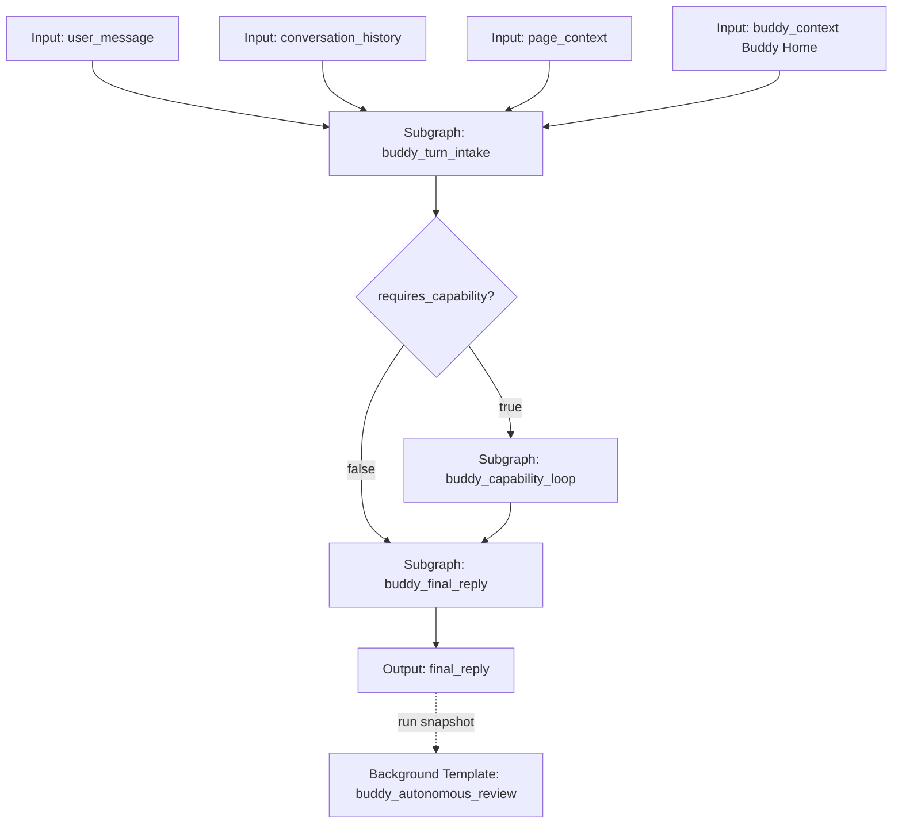
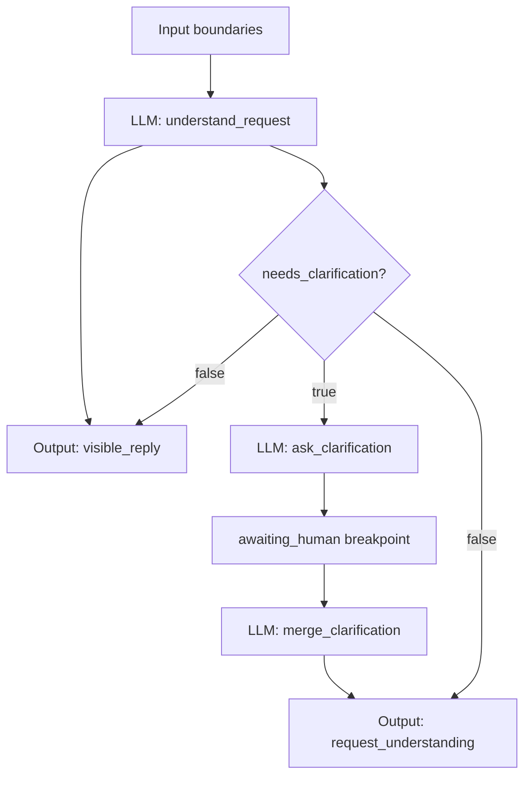
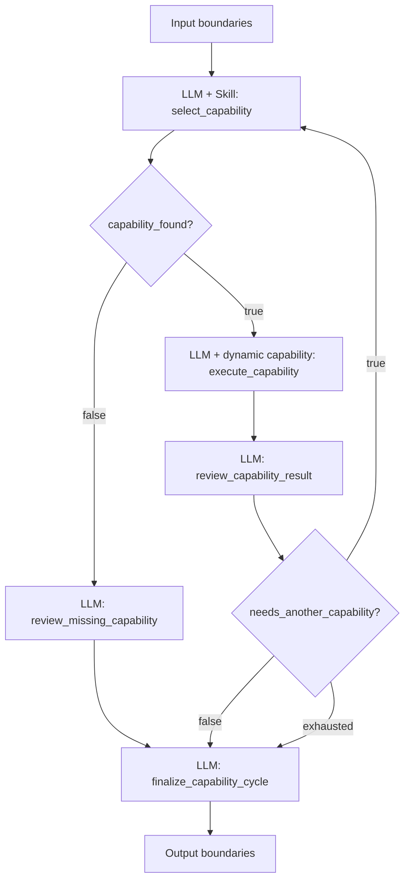
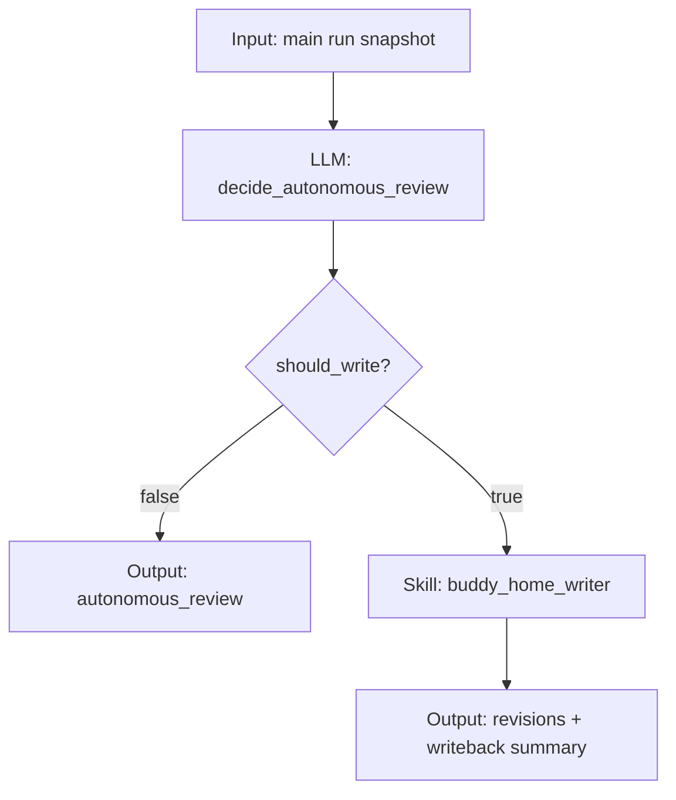

# 伙伴自主 Agent 方针

本文是 TooGraph 伙伴、自主工具循环、技能生成、记忆写回和长期协作能力的唯一长期方针文档。此前关于 Hermes Agent、Claude Code 和伙伴循环模板的调研结论已经折叠进本文；后续不再单独维护这些调研文档。

如果旧文档、临时计划、实现草稿或注释与本文冲突，以本文为准，并把仍然有效的信息折叠回本文或 `docs/current_project_status.md`，不要创建第三份方向文档。

## 核心目标

伙伴不是脱离图系统的特殊 Agent。伙伴收到一条用户消息后，应通过一个可审计 graph run 完成：

```text
用户消息和会话上下文
  -> 创建与该用户消息配对的助手消息和 run capsule
  -> 读取 Buddy Home、页面上下文、历史摘要和运行策略
  -> 生成 request_understanding 和运行过程/暂停上下文中的早期 visible_reply
  -> 判断是否需要能力
  -> 选择一个 capability(kind=skill|subgraph|none)
  -> 由下游 LLM 节点为该能力准备输入
  -> 运行时执行 Skill 或 Subgraph
  -> 将结果封装为 result_package state
  -> 复盘结果并判断是否继续能力循环
  -> 生成 final_reply 或其他父图 root output state
  -> 从完成的 run snapshot 启动后台自主复盘图
  -> 模型自行判断低风险 Buddy Home 写回，并通过受控 writer 生成 command / revision
```

这套循环必须保持图优先、协议唯一、能力显式、权限显式、结果可审计。

## 不可破坏的准则

- 图才是 Agent：整张图表达多步智能，单个 LLM 节点只做一次模型调用、一次结构化输出或一次能力调用准备。
- LLM 单能力：一个 LLM 节点最多使用一个显式能力来源：无能力、一个静态 Skill，或一个输入 `capability` state。多个能力调用必须由多个节点和边表达。
- Skill 单职责：Skill 只做一次受控能力调用。它可以读上下文、准备确定性数据、运行脚本、搜索、写一个受控输出或返回 artifact；不能拥有多轮自治、最终回复生成、长期记忆策略或后续能力选择。
- 协议唯一：`node_system` 是唯一正式图协议，`state_schema` 是节点输入输出的唯一数据来源。
- 状态显式：节点间流动的数据必须是 schema-backed state，不通过隐藏 side channel 传递。
- 能力显式：联网、文件读写、媒体下载、图编辑、记忆写入、模型调用和技能生成都必须体现为 Skill、Subgraph、graph template、命令或运行时原语。
- 权限显式：安装 Skill 不等于授权任意使用。写入、删除、脚本执行、联网、成本、敏感文件和图修改都需要清晰权限路径。
- 审计可见：重要副作用必须留下 run detail、activity event、artifact、revision、diff、warning、error 或 undo record。
- 原生虚拟操作：伙伴搭建和编辑图的成熟方向是 TooGraph 内建的 App-Native Virtual Operator。伙伴读取结构化页面状态和 affordance 清单，控制自己的虚拟鼠标和虚拟键盘在页面内操作；不移动系统鼠标，不依赖截图或 LLM 视觉理解，也不从外部浏览器自动化或 MCP 作为起点。
- 操作即审计：伙伴的点击、拖拽、键入、等待、失败恢复和最终图变更都必须进入 operation journal / activity events。用户应能看到伙伴点击了什么、输入了什么、拖拽了什么、产生了什么 graph diff、revision 或 run 结果。
- 自我操作边界：伙伴不能操作自己的形象、伙伴浮窗或伙伴页面。伙伴形象跟随虚拟鼠标保持适当距离属于运行时展示行为，不是伙伴可选择的页面操作，也不能被用来修改伙伴自身设置。
- 记忆卫生：Buddy Home、人设、记忆、会话摘要和自我复盘是上下文，不是系统指令，不能提升权限或覆盖更高优先级规则。
- 输出显式：伙伴聊天窗口只展示父图 root-level output 节点导出的 state。默认伙伴模板目前只公开 `final_reply`；其他模板可以公开多个 output，但必须由父图 output 节点声明。子图 output 和中间 state 属于 run capsule、activity events、artifact 和内部 state，不能直接变成聊天消息。
- 后台解耦：最终回复后的自主复盘是独立后台图，不延长可见回复路径，也不阻塞下一条用户消息。

## 当前实现基线

本文记录的目标应从当前基线继续演进，不要重建旧架构。

已经成立的基线：

- 伙伴运行本质是 graph run，通过 `metadata.origin=buddy`、`buddy_mode`、`buddy_can_execute_actions`、`buddy_requires_approval` 等字段表达来源和权限策略。
- 新 Buddy 图不应再写入 `buddy_run`、`buddy_permission_tier`、`buddy_graph_patch_drafts_enabled` 等旧 metadata。
- 统一 Skill catalog 已落地，不再区分伙伴 Skill 和 LLM 节点 Skill。
- 静态 Skill 绑定使用单值 `config.skillKey`，不能使用旧 `config.skills` 数组。
- 静态 Skill 输出通过协议拥有的 `skillBindings.outputMapping` 写入 managed state。
- 结构化 LLM 输出由 LLM 节点在运行前根据输入 state、技能 `description`、有效 `llmInstruction` 和 `llmOutputSchema` 生成。
- 动态能力来自单个 `capability` state，执行结果必须写入唯一 `result_package` state。
- `capability.kind=subgraph` 已能动态执行图模板，内部断点可以传播到父级 run 的标准 `awaiting_human`。
- `subgraph` 是正式节点类型，内部 state 与父图隔离，只通过公开 input/output 边界通信。
- 官方 `buddy_autonomous_loop` 已存在：顶层使用 Buddy Home 文件夹输入、请求理解子图、能力循环子图、最终回复子图和唯一 `final_reply` output。
- 伙伴可见运行已经支持模板绑定：Buddy 页面可从可见模板列表选择运行模板，并按 input 节点把当前消息、对话历史、页面上下文和 Buddy Home 上下文绑定进去；权限模式只保留为运行 metadata，不作为图输入。
- 官方 `buddy_autonomous_review` 已存在：主回复完成后由前端用 run snapshot 启动，模型自行判断是否需要低风险写回 Buddy Home，并通过 `buddy_home_writer` 走 command / revision 路径；它不进入普通模板列表和能力选择候选。
- 官方 `toograph_skill_creation_workflow` 已存在：Skill 创建、测试、审查、写入通过图流程表达。
- `advanced_web_research_loop` 已证明“Skill 执行 -> 证据评估 -> 条件循环 -> final_reply”的图式工具循环可行。
- 伙伴浮窗已有按父图公开输出分组的运行过程胶囊、节点级流式输出预览、每步耗时、完成后折叠摘要、请求理解阶段的 `visible_reply` 上下文、正式 root output 回复和后台复盘解耦。
- 伙伴聊天消息已经收敛到父图 root output 协议：一次用户提问可以产生多个由 output 节点声明的独立输出，每个输出独立流式、独立计时；默认 `buddy_autonomous_loop` 只公开 `final_reply`。
- 伙伴运行过程胶囊已经作为 `metadata.kind=output_trace` 的助手消息持久化，刷新页面、切换历史会话或从运行记录恢复后可以还原；这类消息 `include_in_context=false`，只服务聊天 UI 的 run capsule 展示。
- 画布节点计时胶囊、公开 output 耗时和可用模型 token 用量已经通过共享运行遥测投影落地，并能从运行记录恢复。
- 伙伴浮窗已复用标准 `awaiting_human` 暂停卡片，能展示当前产物、上下文、需要补充的字段，并在卡片内续跑当前断点；底部输入在暂停时不会续跑旧断点。
- 伙伴页面已提供资料、策略、记忆、摘要、运行模板绑定、确认、历史和桌宠调试页签；确认页签复用标准暂停卡，历史页签支持目标筛选、字段级 diff、来源 run/command 和 revision 恢复。
- 前端不再设置固定整轮 Buddy 运行超时。
- Buddy Home 默认生成和基础存储已存在，正式形态收束为根目录 `buddy_home/AGENTS.md`、`SOUL.md`、`USER.md`、`MEMORY.md`、`policy.json`、`buddy.db` 和 `reports/`。

仍然存在的关键缺口：

- 第一阶段可见运行闭环已完成：低层 `activity_events` 覆盖 Skill 调用、能力选择审计、权限暂停、动态子图调用、本地文件读取/列表/搜索/写入/脚本、本地文件夹输入上下文读取、脚本测试、`web_search` 下载、图补丁草案和 Buddy Home 写回；运行详情已能聚合父图、子图、低层活动、artifact badge 和权限暂停。
- Buddy Home 自主写回阶段已完成：显式后台模板、受控 writer Skill、command、revision、activity event、运行详情展示和 Buddy Home 历史前后值/来源 run 展示已经落地；Buddy 页面 History 已支持 profile、policy、memory、session summary、run template binding、report 和 capability usage stats 的筛选、字段级紧凑 diff、来源 run/command 和 revision 恢复。
- 伙伴原生虚拟 UI 操作流仍缺结构化页面快照、affordance registry、虚拟鼠标/键盘驱动、操作日志、图变更 diff、graph revision、undo/redo 和完整审计；历史 `graph_patch.draft` stub 不能视为完成方案。
- 子图运行详情后续仍可增强从图预览或缩略图跳转内部节点，但父子运行链路、`subgraph_path` 定位和动态子图断点定位已经进入标准运行详情和确认卡片路径。
- 上下文预算、结果包摘要、大 artifact 按需展开和只读 fanout 并行仍未完成；当前只完成了节点/output 耗时和可用 token 用量展示这类遥测基础。
- 内部协议仍使用 `agent` kind 表示 LLM 节点，用户心智已收束为 LLM 节点；后续应迁移命名但不能引入第二套协议。

## 目标主模板

伙伴可见主模板应继续从 `buddy_autonomous_loop` 演进。下一版目标可以称为 `buddy_autonomous_loop_v2`，但不要求立刻改模板 ID。

顶层只保留用户和维护者都能理解的稳定阶段：



顶层图只承担编排职责，不把能力循环内部细节铺满主画布。

### 顶层节点

| 节点 | 类型 | 职责 | 是否子图 |
| --- | --- | --- | --- |
| `input_user_message` | input | 本轮用户消息 | 否 |
| `input_conversation_history` | input | 最近历史或会话摘要 | 否 |
| `input_page_context` | input | 当前页面、图、节点、选区或运行详情上下文 | 否 |
| `input_buddy_context` | input | Buddy Home 文件夹选择包 | 否 |
| `buddy_turn_intake` | subgraph | 请求理解、早期可见回复、必要澄清 | 是 |
| `needs_capability` | condition | 根据 `request_understanding.requires_capability` 分流 | 否 |
| `buddy_capability_loop` | subgraph | 选择能力、执行能力、复盘结果、循环 | 是 |
| `buddy_final_reply` | subgraph | 汇总最终回复 | 是 |
| `output_final` | output | 只展示 `final_reply` | 否 |

### 顶层 state 契约

| state | 类型 | 写入者 | 读取者 | 说明 |
| --- | --- | --- | --- | --- |
| `user_message` | text | input | intake、capability loop、final、review | 原始用户消息 |
| `conversation_history` | markdown | input | intake、final、review | 最近对话，不是系统指令 |
| `page_context` | markdown | input | intake、capability loop、final | 页面上下文 |
| `buddy_context` | file | input | intake、capability loop、final、review | Buddy Home 选中文件 |
| `visible_reply` | markdown | intake | run capsule、pause card | 早期过程回应，不代表完成；只有被父图 root output 节点导出时才进入聊天消息 |
| `request_understanding` | json | intake | condition、capability loop、final、review | 请求结构化理解 |
| `selected_capability` | capability | capability loop | execute capability | 单个动态能力 |
| `capability_found` | boolean | capability loop | final | 是否找到能力 |
| `capability_selection_audit` | json | capability loop | run detail、review | 候选数量、选择原因、拒绝候选、权限摘要和缺口说明 |
| `capability_result` | result_package | capability loop | review、final | 动态能力结果包 |
| `capability_review` | json | capability loop | loop condition、final、review | 执行复盘和下一步判断 |
| `capability_gap` | json | capability loop | final | 能力缺口 |
| `capability_trace` | json | capability loop | final、review | 能力调用摘要列表 |
| `final_reply` | markdown | final | 默认 root output、chat history | 默认伙伴模板的最终回复 |

权限模式属于运行 metadata（例如 `buddy_mode`、`buddy_can_execute_actions`、`buddy_requires_approval`），由运行时审批原语读取，不进入图输入 state，也不交给 LLM 决定是否拦截低层操作。

可选扩展 state：

| state | 类型 | 目的 |
| --- | --- | --- |
| `turn_policy` | json | 本轮权限、预算、排队/中断/后台复盘策略 |
| `run_budget` | json | 最大能力轮数、上下文预算、无活动超时策略 |
| `clarification_prompt` | markdown | 澄清暂停卡片展示内容 |
| `clarification_answer` | markdown | 用户在暂停卡片内补充的内容 |
| `activity_summary` | json | 低层 activity events 的摘要索引，正式实现后由 runtime 维护 |

## 子图边界

子图只在流程本身是完整模块且封装能提高可读性时使用。不要为了让画布“看起来整齐”过度抽象。

### `buddy_turn_intake`

职责：把用户消息、历史、页面上下文和运行模式整理成结构化请求理解，同时尽快产出 `visible_reply`。

输入：

- `user_message`
- `conversation_history`
- `page_context`
- `buddy_mode`
- `buddy_context` 可选。轻量理解阶段可只读 Buddy Home 的 persona/policy 摘要。

输出：

- `visible_reply`
- `request_understanding`
- `clarification_prompt` 可选

内部流程：



节点契约：

| 节点 | 类型 | LLM 调用 | Skill | reads | writes |
| --- | --- | --- | --- | --- | --- |
| `understand_request` | LLM | 1 次 | 无 | 用户消息、历史、页面上下文、模式 | `visible_reply`、`request_understanding` |
| `need_clarification` | condition | 0 次 | 无 | `request_understanding` | 分支 |
| `ask_clarification` | LLM | 1 次 | 无 | 用户消息、请求理解 | `clarification_prompt` |
| `merge_clarification` | LLM | 1 次 | 无 | 用户消息、请求理解、澄清问题、用户回答 | `request_understanding` |

`request_understanding` 建议结构：

```json
{
  "intent": "chat | answer | research | edit_file | run_command | graph_edit | create_skill | memory_update | automation",
  "user_goal": "一句话目标",
  "known_inputs": ["已经明确的信息"],
  "missing_information": ["缺失但会影响执行的信息"],
  "needs_clarification": false,
  "clarification_focus": "",
  "requires_capability": true,
  "direct_answer_possible": false,
  "risk_level": "low | medium | high",
  "expected_side_effects": ["none | file_read | file_write | subprocess | graph_edit | memory_write | network"],
  "success_criteria": ["本轮完成标准"],
  "response_contract": {
    "should_show_visible_reply": true,
    "final_reply_style": "concise | detailed | step_by_step"
  }
}
```

澄清暂停必须协议化：

- 子图内部 graph metadata 应声明 `interrupt_after: ["ask_clarification"]`。
- `ask_clarification` 完成后进入 `awaiting_human`。
- 暂停卡片展示 `visible_reply`、`clarification_prompt` 和当前请求理解。
- 用户只在暂停卡片里填写一个补充输入。
- resume payload 写入 `clarification_answer` 后继续到 `merge_clarification`。

### `buddy_capability_loop`

职责：选择一个能力、执行一次能力、复盘结果、决定继续能力循环或收束。它是伙伴 Agent 循环的核心模块，必须是子图。

输入：

- `user_message`
- `conversation_history`
- `page_context`
- `buddy_mode`
- `buddy_context`
- `request_understanding`
- `capability_review` 可选，供下一轮选择能力时读取上一轮复盘

输出：

- `selected_capability`
- `capability_found`
- `capability_result`
- `capability_review`
- `capability_gap`
- `capability_trace`

内部流程：



内部节点契约：

| 节点 | 类型 | LLM 调用 | Skill/能力 | reads | writes |
| --- | --- | --- | --- | --- | --- |
| `select_capability` | LLM | 1 次，用于生成 Skill 输入 | 静态 `toograph_capability_selector` | 用户消息、请求理解、上一轮复盘 | `selected_capability`、`capability_found`、`capability_selection_audit` |
| `capability_found_condition` | condition | 0 次 | 无 | `capability_found` | true/false/exhausted |
| `review_missing_capability` | LLM | 1 次 | 无 | 用户消息、请求理解 | `capability_review`、`capability_gap` |
| `execute_capability` | LLM | 1 次，用于生成被选能力输入 | 输入 `selected_capability`，kind 为 skill/subgraph/none | 用户消息、页面上下文、Buddy Home、请求理解 | `capability_result` |
| `review_capability_result` | LLM | 1 次 | 无 | 用户消息、请求理解、能力结果包 | `capability_review`、append `capability_trace` |
| `continue_capability_loop` | condition | 0 次 | 无 | `capability_review.needs_another_capability` | true/false/exhausted |
| `finalize_capability_cycle` | LLM | 1 次 | 无 | found、result、review、gap、trace | 规整 `capability_review` |

`execute_capability` 的边界：

- 它读取一个 `capability` state。
- 它只写一个 `result_package` state。
- 它可以让 LLM 生成被选 Skill 或 Subgraph 的输入。
- 运行时执行能力并封装结果。
- 它不总结结果、不决定下一步、不生成最终回复。

`continue_capability_loop` 的建议：

- `loopLimit` 默认 3，复杂任务可提升到 5，但不应无界。
- true 分支回到 `select_capability`。
- false 分支进入 `finalize_capability_cycle`。
- exhausted 分支进入 `finalize_capability_cycle`，不视为运行失败。最终回复应说明已达到本轮能力调用上限，并基于已有结果收束。

`capability_review` 建议结构：

```json
{
  "executed": true,
  "success": true,
  "summary": "本轮能力调用得到什么",
  "missing_information": [],
  "needs_another_capability": false,
  "next_requirement": "",
  "final_response_strategy": "answer_with_result | ask_user | offer_skill_creation | explain_failure",
  "risk_notes": [],
  "artifacts": [],
  "permission_notes": []
}
```

`capability_trace` 条目建议：

```json
{
  "round": 1,
  "capability": {
    "kind": "skill",
    "key": "web_search",
    "name": "联网搜索"
  },
  "success": true,
  "summary": "查到并保存了 4 个来源",
  "next_requirement": "",
  "duration_ms": 0,
  "artifact_refs": []
}
```

`duration_ms` 和 artifact refs 最好由 runtime 或 activity events 补齐，不应完全由 LLM 编造。

找不到能力不是异常。`review_missing_capability` 应输出：

```json
{
  "missing_goal": "需要什么能力",
  "available_alternatives": ["当前可做的替代路径"],
  "should_offer_build": true,
  "should_route_to_builder": false,
  "suggested_skill_or_template": {
    "kind": "skill | subgraph | template",
    "name": "建议名称",
    "reason": "为什么需要"
  }
}
```

最终回复可以询问是否进入 `toograph_skill_creation_workflow` 或新建模板流程，但不能假装已经创建能力。

### `buddy_final_reply`

职责：把请求理解、能力结果和能力轨迹变成最终用户回复。

输入：

- `user_message`
- `conversation_history`
- `page_context`
- `buddy_context`
- `request_understanding`
- `capability_found`
- `capability_result`
- `capability_review`
- `capability_gap`
- `capability_trace`

输出：

- `final_reply`

内部只需要一个 `draft_final_reply` LLM 节点和一个 output 边界。除非后续明确引入“起草 -> 校验 -> 修正”流程，否则不要继续拆小。

`final_reply` 规则：

- 只包含用户该看到的内容。
- 不暴露内部 state 名称，除非路径、URL、错误原因是用户需要的证据。
- 如果有能力缺口，明确说明缺什么，给出下一步选择。
- 如果执行过受控副作用，说明结果、artifact、revision 或审批状态。
- 如果循环耗尽，用已有结果收束，不把 exhausted 写成崩溃。

### 不应封装成子图的内容

- 单个 condition 节点，例如顶层 `needs_capability`。
- 单个 output 节点。
- 运行时权限审批。文件写入、脚本执行、删除等审批属于 runtime permission 原语，应暂停当前节点，不要做成 LLM 询问用户“你批准吗”。
- 只有一个 LLM 节点且没有可复用边界的微流程。
- 低层活动事件。`activity_events` 是运行记录层，不应由子图伪造。
- provider retry、stream idle watchdog、模型 fallback。这些是 runtime primitive，不应变成图里一堆节点。

## 后台复盘和写回

`buddy_autonomous_review` 是内部后台模板，不进入普通模板列表和能力选择候选。

它应在可见主运行 completed 后，从主 run snapshot 启动：



当前正确边界是：用户不确认每次 Buddy Home 是否应该更新；是否更新由模型在自主复盘图中判断。低风险 memory、session summary、profile、`policy.communication_preferences`、精炼复盘报告和能力使用统计写回自动通过 `buddy_home_writer` 应用并留下 command、revision 和 activity event；权限升级、能力边界扩大、任意文件写入、脚本执行、图补丁和 revision restore 不属于自动写回范围。

写回模板必须返回 revision ID、diff 或 previous value reference，方便撤销和审计。

## 暂停、恢复、拒绝和取消

伙伴循环至少有四类停顿或用户介入。

### 澄清暂停

来源：`buddy_turn_intake.ask_clarification` 后的 `interrupt_after`。

UI 行为：

- 当前助手消息继续显示 run capsule。
- capsule 内出现暂停卡片。
- 卡片先展示已产出的 `visible_reply` 和 `clarification_prompt`。
- 只有一个补充输入区域。
- 用户提交后写入 `clarification_answer` 并 resume 原 run。

### 权限审批暂停

来源：Skill 或动态 Subgraph 内部触发 risky permission，例如 `file_write`、`file_delete`、`subprocess`。

UI 行为：

- 暂停卡片展示技能名、权限类型、输入预览、风险说明、已产出上下文。
- 主操作：执行当前方案。
- 补充操作：补充内容，写入当前 pause resume payload。
- 必须补齐：拒绝本次能力。
- 必须补齐：取消整轮 run。

拒绝不等于失败。拒绝应产生结构化 denial result，让 `review_capability_result` 能继续生成解释或替代方案。

### 能力缺口收束

来源：`toograph_capability_selector` 返回 `kind=none`，或能力执行结果显示当前能力无法满足。

行为：

- 不进入权限审批。
- 最终回复里提供清楚选项：继续对话、创建 Skill、创建图模板、手工补充信息。
- 若用户选择创建能力，应启动 `toograph_skill_creation_workflow` 或图模板创建流程作为下一轮 run。

### 运行中追加输入

运行中新输入必须明确语义：

| 语义 | 适用场景 | UI |
| --- | --- | --- |
| queue | 用户发起新问题 | 底部输入发送后排队为下一轮 |
| supplement | 用户补充当前 run | 当前 run capsule 内的“补充当前运行”操作 |
| interrupt | 用户停止当前任务改问 | 当前 run capsule 内“停止并改问” |

不要出现多个并列输入框。底部输入是会话输入，暂停卡片输入是当前断点输入，二者同一时间只能有一个承担“继续当前 run”的含义。

## 伙伴悬浮窗口方针

悬浮窗口可以大改，但必须保持一个会话 lane 和消息级 run capsule。

### 每条助手消息绑定 run capsule

每条用户消息创建一条助手占位消息：

```text
用户消息
伙伴消息
  - visible_reply 或 activity text
  - run capsule
      - preparing
      - intake_request
      - selecting capability
      - executing capability
      - awaiting human
      - drafting final reply
      - completed / failed / cancelled
  - final_reply
```

不要只有一个全局“当前运行过程”。历史里的每条助手消息都应保留自己的运行过程摘要。

### run capsule 信息层级

默认折叠，只显示：

- 当前阶段或完成摘要。
- 耗时。
- 是否等待用户。
- 最近一条 activity summary。

展开后显示：

- 节点开始/完成/失败。
- 流式输出预览。
- Skill/Subgraph 选择和结果摘要。
- 权限审批记录。
- artifact 链接。
- 子图 scope path。

### 运行时长策略

不应有固定整轮超时。应采用：

- 后端 run 有最后活动时间。
- 前端持续接收 SSE heartbeat 或轮询状态。
- 无活动超过阈值时显示“可能卡住”，允许用户取消或继续等待。
- 有活动时无限等待。
- 节点级、Skill 级和 provider 级可以有自己的 idle watchdog。

## 低层 Activity Events

伙伴浮窗和运行详情页需要统一 `activity_events`，表达图运行内部发生的低层操作摘要。这类信息不应由 LLM 编写，也不应只存在于前端临时文本里，而应由运行时、Skill、文件/命令执行原语产生，写入 run artifacts，并通过 SSE 推送。

目标效果：

```text
Explored 7 files
Downloaded 5 sources
Ran python -m pytest -q, exit 0
Editing skill/user/foo/SKILL.md +84 -0
Paused for file_write approval
```

推荐事件形状：

```json
{
  "kind": "file_edit",
  "run_id": "run_x",
  "node_id": "execute_capability",
  "subgraph_path": ["buddy_capability_loop"],
  "summary": "Editing skill/user/foo/SKILL.md +84 -0",
  "detail": {
    "path": "skill/user/foo/SKILL.md",
    "added": 84,
    "removed": 0
  },
  "duration_ms": 420,
  "created_at": "..."
}
```

首批事件来源：

- 伙伴虚拟鼠标/键盘操作、affordance 选择、操作失败和重试。
- 空白画布搭建、节点创建、节点拖拽、端口连线、节点配置输入、保存和运行点击。
- 文件读取、目录枚举、搜索。
- 命令执行、脚本测试。
- 联网下载和资料保存。
- Skill/Subgraph 开始、完成、失败、权限暂停。
- Buddy Home 写入。
- 图补丁草案、预览、应用和 revision。

展示规则：

- 伙伴浮窗使用同一渲染器显示灰色过程摘要，运行中可展开，完成后默认折叠。
- 运行详情页复用同一渲染器，不维护第二套解释逻辑。
- 摘要面向人类扫描，detail 面向审计和调试。
- 敏感路径、密钥、完整错误大段日志和大型文件内容不能直接铺到浮窗里。

## 并行加速方针

可以借鉴 Hermes 的 delegation 和 Claude Code 的事件化执行，但 TooGraph 必须先保持协议边界。

### 现在可以做或接近可以做

- 前端预取并行：打开浮窗或用户输入时预取 Buddy 模板、Skill catalog、模型列表和 Buddy Home 摘要。
- 后台复盘并行：主回复完成后启动 `buddy_autonomous_review`，不占用 active run，不阻塞下一轮。
- Skill 内部并行：`web_search` 下载多个来源、未来文件扫描、批量检索可以在 Skill 内部并行，但仍作为一次 Skill 调用输出结构化结果。
- UI 流式并行：SSE、轮询、消息持久化和 run capsule 更新与后端执行并行。
- 能力候选缓存：`toograph_capability_selector.before_llm.py` 可短 TTL 缓存启用模板和 Skill 清单。

### 需要运行时增强后才能做

- 图级安全并行节点。LangGraph 可表达 DAG fanout，但 TooGraph 还需要安全的状态 reducer、短锁、事件顺序和 run store 合并策略。
- 并行上下文装配。Buddy Home 摘要、页面上下文压缩、历史摘要、能力候选读取、记忆检索可并行 fanout，再由一个 LLM 节点合并。
- 并行只读能力。若要同时跑两个搜索子图或诊断子图，应使用固定图 fanout 或显式 parallel group runtime，不能把 `capability` 改成列表。
- 并行子任务 delegation。父图可以有多个 Subgraph 节点或一个受控 parallel-subgraph primitive，结果汇总到 review LLM 节点。

### 不应并行

- `select_capability -> execute_capability -> review_capability_result` 依赖链不能并行。
- 权限审批不能绕过等待并行继续执行高风险动作。
- 同一个文件或同一张图的写入不能并行，除非已有 patch merge、conflict detection 和 revision。
- `final_reply` 不应早于能力复盘完成，除非明确作为 `visible_reply` 而不是最终回复。

## Skill 和 Capability 契约

### Skill Manifest

Skill 包应自包含：代码、提示、schema、脚本、资产、示例和本地说明都在包内。

关键字段语义：

- `name`：显示名称。顶层和 `llmOutputSchema` / `stateOutputSchema` 均使用 `name`，不再使用 `label`。
- `description`：什么时候选择这个技能。
- `llmInstruction`：绑定到 LLM 节点后，如何根据当前 state 生成结构化 LLM 输出。
- `stateInputSchema`：绑定 Skill 的 LLM 节点需要读取的图 state，不用于 `before_llm.py`。
- `llmOutputSchema`：LLM 本轮结构化输出 schema，随后作为 `after_llm.py` 输入；声明出的字段会进入结构化输出 schema，缺失时由运行时记录可恢复错误。
- `stateOutputSchema`：Skill 结果中可写入下游 state 的输出 schema。静态绑定时由 `skillBindings.outputMapping` 映射到 state。
- `permissions`：声明副作用，不代表自动授权。

生命周期脚本使用固定文件名：

- `before_llm.py`：技能 LLM 输出规划前执行，只读取运行时上下文，把 auditable context 注入 LLM 提示词。
- `after_llm.py`：LLM 生成结构化 LLM 输出后执行，把 JSON 结果作为技能输出。

脚本不得直接写图 state，state 绑定仍由运行时根据 `stateOutputSchema` 和 output mapping 完成。

### Capability State

`capability` 是单个互斥对象：

```json
{
  "kind": "skill",
  "key": "web_search",
  "name": "联网搜索",
  "description": "执行联网搜索并保存来源原文",
  "permissions": ["network"]
}
```

允许的 `kind`：

- `skill`
- `subgraph`
- `none`

禁止：

- `capability` 列表。
- 一个 LLM 节点一次选择多个能力。
- 用 `capability` state 只做“候选列表保存”，因为读取 `capability` 的 LLM 节点会被视为动态能力执行节点。

### Result Package

动态能力执行只写一个 `result_package` state：

```json
{
  "source": {
    "kind": "skill",
    "key": "web_search",
    "name": "联网搜索"
  },
  "status": "succeeded",
  "duration_ms": 1234,
  "outputs": {
    "artifact_paths": {
      "name": "artifact_paths",
      "description": "保存到本地的来源原文路径",
      "type": "file",
      "value": ["backend/data/artifacts/source.md"]
    }
  },
  "errors": [],
  "warnings": []
}
```

包内输出使用 `outputs.<outputKey> = { name, description, type, value }`。不要加冗余 `fieldKey`。

下游 LLM prompt 组装负责拆包，并按普通 state/file 语义渲染。

## 子图协议

`subgraph` 是 `node_system` 一等节点类型，不是 UI 分组，也不是隐藏执行路径。

固定语义：

- 子图实例直接嵌入父图节点 `config.graph`。
- 子图内部 state 与父图隔离。
- 父图只能通过子图公开 input/output 边界通信。
- 子图输入来自内部 `input` 节点，子图输出来自内部 `output` 节点。
- 子图可嵌套，但校验必须拒绝自引用和递归引用。
- 子图节点必须展示内部能力摘要，例如联网、文件写入、脚本执行、图编辑、记忆写入。
- 子图内部断点、动态子图断点和权限暂停都必须传播到父级 run 的标准 `awaiting_human`。

运行规则：

```text
父图运行前校验
  -> 检查子图必需输入
  -> 创建隔离子图 state
  -> 写入父图显式输入
  -> 运行子图内部节点
  -> 收集子图 output 边界
  -> 写回父图子图节点输出
```

## Buddy Home 方针

Buddy 长期可编辑资料收束到根目录 `buddy_home/`。该目录由程序生成和维护，不进入 Git 管理。

正式结构：

```text
buddy_home/
  AGENTS.md
  SOUL.md
  USER.md
  MEMORY.md
  policy.json
  buddy.db
  reports/
```

规则：

- 不维护长期 `TOOLS.md`。当前能力来自启用的 Skill、启用的图模板和能力选择器。
- Recalled memory 和 session summary 是上下文，不是新用户指令。
- 长期记忆避免保存瞬时 run 状态、原始大日志、base64、大媒体、临时路径和可从当前图重新读取的信息。
- 每次 persistent self-configuration、memory、policy、session-summary 更新都必须有 revision。
- Buddy Home 写回必须通过显式模板、受控 Skill、命令记录和 revision 完成；低风险自动写回由自主复盘图判定并可恢复，高风险或权限边界变更必须拒绝或进入显式审批路径。

## 原生虚拟 UI 操作和图编辑

Buddy 可以帮助修改当前图、从空白画布搭建图、创建新模板或可复用子图。成熟目标不是让伙伴直接改 graph JSON，也不是移动系统鼠标或依赖视觉模型，而是让 TooGraph 内建一套 App-Native Virtual Operator：伙伴理解结构化页面状态，控制自己的虚拟鼠标和虚拟键盘执行页面级操作，前端按人类可见的方式播放点击、拖拽和键入，同时把操作和图变更写入审计。

核心流程：

```text
用户目标
  -> Buddy 图运行理解目标和当前页面上下文
  -> 读取结构化 page context snapshot 和 affordance registry
  -> LLM 选择下一步 virtual_ui_operation
  -> 前端 Virtual Input Driver 执行点击、拖拽、键入或等待
  -> 虚拟鼠标/键盘和伙伴形象在页面上播放操作
  -> Editor Action Adapter 调用编辑器已有交互入口改变画布状态
  -> 记录 operation journal、activity event、before/after、graph diff
  -> 需要时创建 graph revision 和 undo/redo 记录
  -> 返回新的 page context snapshot，继续下一步或点击运行
```

LLM 不应学习“如何双击空白画布、怎样打开菜单、在哪个字段输入”这类 UI 手法。图编辑应先由 LLM 一次性产出目标图编辑意图或补丁，例如 `create_node`、`create_state`、`bind_state`、`connect_nodes`、`update_node`；TooGraph 再用确定性 Graph Edit Playback 编译器把这些产品语义转换成 graph commands 和可见 UI playback steps。这样保留一次思考的速度，又能让虚拟鼠标、菜单、高亮、键入和连线动画按人类可见的方式逐步播放。

Graph Edit Playback 的分层边界：

```text
LLM 目标图编辑意图
  -> 验证和引用解析
  -> graph commands
  -> UI playback steps
  -> Virtual Input Driver + Editor Action Adapter
  -> graph diff / revision / undo / activity journal
```

### Skill 生命周期边界

页面操作应通过一个语义级 Skill 和运行时虚拟操作层协作完成，而不是把每个鼠标动作拆成独立 Skill。

推荐形态：

```text
before_llm.py
  -> 根据运行时页面上下文读取页面操作书、结构化页面内容和允许操作

LLM
  -> 只输出一条语义命令，例如点击“历史”页签

after_llm.py
  -> 校验命令、目标和权限
  -> 调用 TooGraph Virtual Operator Runtime 执行
  -> 返回 ok、operation journal、cursor_session_id 和结构化错误

Virtual Operator Runtime
  -> 解析 affordance
  -> 控制 Virtual Input Driver 播放虚拟鼠标、点击、拖拽、键入和等待
  -> 通过页面或编辑器 action adapter 触发真实业务逻辑
  -> 写入 operation journal、activity_events、必要的 diff / revision / undo 线索
```

`after_llm.py` 是单次 Skill 调用的执行收口，但不拥有虚拟鼠标动画、DOM layout 计算、伙伴形象追随、用户接管、页面路径推断或页面会话状态。虚拟鼠标移动属于 TooGraph 应用运行时和前端 Virtual Input Driver；Skill 只提交受控执行请求并接收结果。操作后的页面状态由下一轮运行时页面操作书重新采集，不作为 Skill 的 `next_page_path` state 输出。

虚拟鼠标是否回收由操作会话决定，而不是每个底层动作自动决定。单步页签切换可以在执行后飞回伙伴头顶；连续图编辑应保持同一个 `cursor_session_id`，等子图或操作链完成后再统一回收。

### 借鉴 Computer Use / CUA 的成熟部分

OpenAI Computer Use / CUA 的成熟经验可以借鉴在“可审计动作循环”上，而不是照搬成 TooGraph 的实现形态。可复用的核心是：

```text
观察当前状态
  -> 选择一个明确 UI 动作
  -> 执行动作
  -> 记录动作和结果
  -> 再观察新状态
```

TooGraph 的对应路线：

- 动作词表可参考成熟 computer-use 协议，覆盖 `move`、`click`、`double_click`、`drag`、`scroll`、`type`、`keypress`、`wait`、`screenshot/observe` 等基础动作；其中 `screenshot/observe` 在 TooGraph 中应替换为结构化 `page_context_snapshot`，不让伙伴依赖截图视觉理解页面。
- 每个动作的目标必须是稳定 affordance id、结构化 bounds 和允许参数，而不是 LLM 临时猜 DOM selector 或视觉坐标。
- 执行层是 TooGraph 前端内建的 Virtual Input Driver。它播放伙伴自己的虚拟鼠标和虚拟键盘，不移动系统鼠标，不抢占真实用户设备焦点。
- 图状态变化仍通过 Editor Action Adapter 走编辑器已有交互和命令路径。DOM 点击可以作为“人类可见的表演层”和输入事件路径的一部分，但不能成为唯一真实来源；真实审计必须同时记录 affordance、动作参数、before/after、expected change、graph diff、revision 和 undo/redo。
- 伙伴不能操作自己的形象、伙伴浮窗或伙伴页面。形象靠近虚拟鼠标只是展示层距离管理，不进入伙伴可选择的业务动作集合。

参考的外部材料应限定为官方 OpenAI Computer Use tool guide（`https://developers.openai.com/api/docs/guides/tools-computer-use`）、CUA / Operator 介绍（`https://openai.com/index/computer-using-agent/`）和 Operator System Card（`https://cdn.openai.com/operator_system_card.pdf`）；这些材料只提供成熟交互循环和安全审计启发，不改变 TooGraph “结构化页面理解 + 应用内虚拟输入 + 图命令审计”的路线。

### 页面理解：结构化快照而不是视觉识别

伙伴不通过截图理解页面，也不依赖 LLM 视觉能力。页面应提供结构化快照：

```json
{
  "page": "graph_editor",
  "active_graph": {
    "graph_id": "graph_123",
    "name": "Untitled Graph",
    "nodes": [],
    "edges": [],
    "selected_node_ids": []
  },
  "virtual_pointer": {
    "x": 320,
    "y": 240
  },
  "buddy_avatar": {
    "x": 280,
    "y": 260,
    "max_distance_from_pointer": 260
  },
  "affordances": [
    {
      "id": "canvas.blank",
      "role": "canvas",
      "label": "Graph canvas",
      "enabled": true,
      "bounds": {"x": 0, "y": 64, "w": 1280, "h": 720},
      "actions": ["click", "drag", "drop_node"]
    }
  ]
}
```

快照由前端和运行时生成，表达当前页面、画布、节点、边、选区、菜单、弹窗、输入焦点、运行状态、可操作元素和禁用原因。它是伙伴的页面感知来源，不是用户指令，也不提升权限。

### Affordance Registry

所有伙伴可操作的 UI 都必须注册为稳定 affordance。每个 affordance 至少包含：

- 稳定 `id`，例如 `toolbar.add_node`、`node.agent_1.title`、`node.agent_1.output.final_reply`。
- `role`、`label`、`enabled`、`visible`、`bounds`、`actions`。
- 当前状态，例如 selected、focused、expanded、menu_open、validation_error。
- 允许的操作参数，例如可输入文本类型、可拖拽目标、可选择菜单项。

首批 affordance 应覆盖：

- 空白画布和画布视口。
- 添加节点入口和节点创建菜单项。
- input / LLM / condition / output / subgraph 节点卡片。
- 节点标题、介绍、关键配置入口和状态端口。
- 节点拖拽手柄、连线锚点和可放置目标。
- 保存、运行、取消运行和运行状态入口。
- 标准弹窗确认按钮和错误提示。

禁止把伙伴操作绑定到脆弱的 CSS selector 或裸 DOM 结构。DOM 可以是前端实现细节，但伙伴只看到 affordance，不直接选择 DOM。

### Virtual Input Driver

伙伴发出的操作是页面级虚拟输入，而不是系统输入：

```json
{
  "kind": "click",
  "target": "toolbar.add_node",
  "reason": "打开节点创建菜单"
}
```

```json
{
  "kind": "type",
  "target": "node.agent_1.title",
  "text": "整理用户需求",
  "reason": "给 LLM 节点命名"
}
```

```json
{
  "kind": "drag",
  "from": "node.agent_1.output.request_understanding",
  "to": "node.condition_1.input.request_understanding",
  "duration_ms": 700,
  "reason": "连接请求理解到条件判断"
}
```

Virtual Input Driver 的责任：

- 根据 affordance 当前 bounds 计算虚拟鼠标轨迹。
- 播放移动、按下、释放、拖拽、滚轮和逐字键入动画。
- 调用编辑器内部 action adapter，而不是改 DOM 或直接写 graph JSON。
- 每步后检查 expected change 是否发生。
- 失败时返回结构化错误、当前快照和可恢复建议。

虚拟鼠标应始终是伙伴自己的鼠标。它不移动系统鼠标，不抢占用户设备焦点。真实用户可以随时中断、暂停或接管。

### 伙伴形象和虚拟鼠标距离

伙伴形象应和虚拟鼠标保持不远的空间关系，避免出现鼠标在远处操作而伙伴形象停留在另一端的割裂感。

规则：

- 页面维护 `max_distance_from_pointer`，初始可取 220-320px，并根据视口尺寸调整。
- 当虚拟鼠标下一步目标超过该距离时，运行时先让伙伴形象移动到鼠标附近或沿路径跟随。
- 形象移动是展示层行为，可以记录为低优先级 `avatar_follow` event，但不进入伙伴可选择的业务操作集合。
- 伙伴不能点击、拖拽、配置、隐藏或修改自己的形象，也不能操作伙伴浮窗或伙伴页面。
- 伙伴页面、伙伴浮窗、形象调试面板和自我配置入口必须从 affordance registry 中对伙伴隐藏或标记为 forbidden。

### Editor Action Adapter

Virtual Input Driver 不直接改 graph JSON。它通过编辑器已有交互入口或专门 action adapter 完成和人类操作等价的状态变化：

- 点击“添加节点”打开同一个菜单。
- 选择菜单项创建同一种节点。
- 拖拽节点走同一套节点移动逻辑。
- 从端口拖到端口走同一套连线校验逻辑。
- 在节点输入框键入走同一套表单校验和保存逻辑。
- 点击运行走同一套图校验、保存/运行和 run capsule 展示路径。

这条路径保留“像人一样操作页面”的产品体验，同时避免脆弱 DOM 模拟。对于 graph 资产的最终变更，adapter 必须产出 before/after、diff、validator 结果和必要 revision / undo 记录。

### Operation Journal 和审计

每个虚拟操作都应写入 operation journal，并可汇总为 run activity：

```json
{
  "operation_id": "op_001",
  "kind": "click",
  "target": {
    "id": "toolbar.add_node",
    "role": "button",
    "label": "Add node"
  },
  "input": {},
  "status": "succeeded",
  "started_at": "...",
  "completed_at": "...",
  "before": {"menu_open": null},
  "after": {"menu_open": "node_creation"},
  "summary": "Clicked Add node."
}
```

图编辑类操作还要附带 graph change summary：

```json
{
  "kind": "graph_change",
  "summary": "Added LLM node '整理用户需求'.",
  "diff": {
    "nodes_added": ["agent_1"],
    "edges_added": []
  },
  "validation": {"valid": true},
  "revision_id": "rev_123"
}
```

审计目标不是只说明“最后图变了”，而是能回放“伙伴点击了什么、输入了什么、拖拽了什么、为什么失败或成功、产生了什么图变化、是否运行成功”。

### 新建完整图和编辑已有图

直接生成完整 graph JSON 仍然是合法能力，适合一次性创建完整模板、导入模板或快速搭建初稿。成熟体验中可以有两种呈现方式：

- 快速生成：LLM 生成完整图 JSON，后端校验，前端渲染并保存。
- 可见搭建：伙伴把计划拆成一系列 virtual_ui_operation，在空白画布上创建节点、拖拽布局、连线、配置并点击运行。

用户明确要求“像人在网页上操作”时，应使用可见搭建或可见编辑路径。用户只要求“生成一个模板文件”时，可以使用快速生成路径，但仍需校验、预览、保存和记录来源。

## 当前官方模板角色

### `buddy_autonomous_loop`

默认可见伙伴主循环。它应继续承担：

- 输入用户消息、历史、页面上下文、伙伴模式、Buddy Home。
- `buddy_turn_intake` 产出 `visible_reply` 和 `request_understanding`。
- 简单闲聊或可直接回答时绕过能力循环。
- `buddy_capability_loop` 选择能力、执行能力、复盘结果、必要时循环。
- `buddy_final_reply` 产出唯一 `final_reply`。
- `output_final` 只展示 `final_reply`。

### `buddy_autonomous_review`

内部后台自主复盘模板。它应继续：

- 从主 run snapshot 读取用户消息、历史、页面上下文、Buddy Home、请求理解、能力结果、复盘和最终回复。
- 产出 `autonomous_review` 和 `writeback_commands`。
- 在模型判断需要低风险写回时调用 `buddy_home_writer`，通过 Buddy command/store 写入并生成 revision。
- 拒绝自动权限升级、能力边界扩大、任意文件写入、脚本执行、图补丁和 revision restore。
- 不进入普通模板列表和能力选择候选。

### `toograph_skill_creation_workflow`

创建用户 Skill 的显式图流程。它应继续：

- 检查已有能力。
- 澄清需求。
- 确认示例输入输出。
- 生成 Skill 文件内容。
- 测试脚本或生命周期入口。
- 失败后回环修复。
- 写入前审查。
- 用户批准后通过受控 Skill 写入 `skill/user/<skill_key>/`。

### `advanced_web_research_loop`

高级联网搜索模板。它不是 Buddy 主循环，但可作为联网研究子流程参考：

- 搜索词由绑定 `web_search` 的 LLM 节点运行时生成。
- 搜索结果以文件 artifact 形式传给下游 LLM。
- condition 回边控制补搜，`exhausted` 用已有证据收束。
- 模板只公开 `final_reply`。

## 阶段性任务

这些阶段不是一次性大重构计划，而是长期目标的交付顺序。每个阶段都可以继续拆成小提交；后续阶段不能通过绕开前一阶段的协议、权限和审计约束来提速。

小目标粒度规则：

- 一个小目标应能在一次提交内完成，并包含相应测试和必要文档更新。
- 小目标不拆到“写一个函数、改一个按钮”的级别；它应交付一个用户或维护者能验证的行为闭环。
- 小目标也不能大到横跨多个互相独立的子系统；如果需要同时改运行时、模板、前端和存储，应优先拆成多个小目标。
- 每次提交信息应能直接对应下面一个小目标；完成后在本文或 `docs/current_project_status.md` 中更新状态。

### 阶段 1：可见运行闭环和审计补全

目标：让每一次伙伴可见运行都能被用户理解、暂停、恢复、拒绝、取消和回看。

状态：已完成。后续只接受围绕可见运行链路的修正和回归修复，不再新增阶段 1 的主目标。

小目标：

1. [已完成] 文件列表/搜索活动事件：`local_workspace_executor` 已支持图内 `list` 和 `search` 操作，并返回 `file_list` / `file_search` 低层 `activity_events`，记录 path、query、结果数量、跳过项和失败原因；通用 run capsule 和运行详情可回放这些事件。
2. [已完成] 澄清暂停协议核验：`buddy_turn_intake` 的澄清等待由 `interrupt_after=["ask_clarification"]`、`pending_subgraph_breakpoint`、resume payload 和标准 `awaiting_human` 表达；已补充历史 pause snapshot 恢复时保留 pending 子图协议、悬浮窗刷新后按 run metadata 还原澄清卡片、取消清理 pending metadata、权限拒绝走 resume payload 的测试覆盖，不再依赖缺必填 state 报错来驱动澄清暂停。
3. [已完成] 暂停期间队列策略：新增共享 `buddyPauseQueuePolicy`，明确全局输入框在存在 paused run 时只定位到当前暂停卡，补充当前断点必须走暂停卡的 `supplement` 模式，开启新用户回合必须先完成或取消当前暂停；队列 drain 遇到 paused run 会保持剩余回合不继续执行，悬浮窗和全局 Buddy 入口使用同一套状态转换。
4. [已完成] 伙伴页面确认视图：已抽出共享 `BuddyPauseCard` 作为标准暂停卡片，悬浮窗和 Buddy 页面都通过它处理确认继续、权限拒绝、取消、补充输入和恢复；Buddy 页面新增“确认”页签，加载 `awaiting_human` 的伙伴运行并通过 `resumeRun` / `cancelRun` 走统一 run 协议，不复制第二套确认 UI 状态机。
5. [已完成] 父子图运行详情聚合：运行详情页已通过统一 timeline model 展开父图节点、静态/动态子图节点、低层 `activity_events` 和权限暂停项，按时间排序并保留 `subgraph_path` / 内部节点路径，用户可以从同一条时间线回看父子图执行链路。
6. [已完成] 能力选择审计摘要：`toograph_capability_selector` 已返回 `audit` 输出并记录 `capability_selection` 低层活动事件，包含候选能力数量、按类型计数、选中能力、选择原因、被拒绝候选简短原因、选中权限摘要、缺口说明和 catalog 读取错误；`buddy_autonomous_loop` 已把该输出映射到 `capability_selection_audit` state 并提供输出节点，运行详情可回看 Buddy 为什么用了某个 Skill 或 Subgraph。
7. [已完成] 父图公开输出协议：伙伴聊天窗口只消费父图 root-level output 节点；子图 output 和中间 state 不再直接生成聊天消息。每个 output 独立流式、独立计时，计时从上游节点开始运行时启动，并在对应 state 到达时结束。
8. [已完成] 节点运行遥测：后端持久化 `node_executions`，前端通过共享 `runTelemetryProjection` 驱动画布节点计时胶囊、公开 output 耗时、运行恢复计时还原和可用模型 token 用量显示。
9. [已完成] 伙伴运行模板绑定：伙伴页面新增运行模板绑定页签，可选择可见模板，并把当前消息、对话历史、页面上下文和 Buddy Home 上下文绑定到 input 节点；默认绑定指向 `buddy_autonomous_loop`，权限模式只保留为运行 metadata。
10. [已完成] 运行胶囊持久化：伙伴运行过程胶囊按父图公开输出分组生成，并作为 `metadata.kind=output_trace` 的助手消息保存到 `buddy_messages.metadata_json`；刷新、切换历史会话或恢复运行记录后能还原胶囊，同时不进入 LLM 上下文。

完成口径：

- 每组父图公开输出前都有配对 run capsule，能展示过程回应、能力调用、权限暂停、错误和低层活动摘要。
- 运行刷新、重新打开会话、拒绝、取消和断点续跑都走同一套 run 协议，不依赖前端临时状态。
- 运行详情能解释“做了什么、为什么暂停、用了什么能力、产出了什么 artifact”。

### 阶段 2：受控 Buddy Home 写回

目标：把后台复盘产出的记忆、人设、偏好和策略更新，从“计划”推进到模型自主判断、低风险自动写入、用户可见历史和可恢复版本。

状态：已完成。后续只接受围绕 Buddy Home 写回链路的修正和回归修复，不再新增阶段 2 的主目标；下一步进入阶段 3 的图补丁草案协议。

小目标：

1. [已完成] 自主复盘模板：`buddy_autonomous_review` 已替代旧后台复盘模板，显示名为“自主复盘”，从可见 run snapshot 读取上下文，模型自行判断 `autonomous_review.should_write` 并产出 `writeback_commands`。
2. [已完成] Buddy Home writer Skill：`buddy_home_writer` 已新增为内部官方 Skill，只通过 Buddy command/store 写入，返回 applied/skipped commands、revision 列表和 `buddy_home_write` activity event，并拒绝 `graph_permission_mode` 等权限边界修改。
3. [已完成] Buddy Home revision 存储：Buddy profile、policy、memory、session summary 的 command / revision / restore 基础路径已存在，writer 写回会复用该路径。
4. [已完成] 写回结果展示：`buddy_home_write` activity event 会携带 applied/skipped/revision 明细；run capsule、运行详情和 Buddy Home 历史页能展示写回摘要、前后值、revision、来源 run / command、跳过原因和失败原因。
5. [已完成] 基础版本切换体验：Buddy 页面 History 已支持按目标筛选、字段级紧凑 diff、来源 run/command 展示和 revision 恢复。后续如果继续优化，应集中在批量比较、预览恢复影响和更清晰的恢复确认文案。
6. [已完成] 写回范围扩展：`buddy_home_writer` 已将自主 `policy.update` 收紧到 `communication_preferences`，并新增 `report.create` 与 `capability_usage_stats.update`；报告写入 `buddy_home/reports/`，能力统计写入 `buddy_kv.capability_usage_stats` 并进入 Buddy Home context pack，二者都走 command / revision / restore 路径，也进入 Buddy 页面 History 筛选。

完成口径：

- `buddy_autonomous_review` 能完成模型自主判断和低风险自动写回。
- 每次 Buddy Home 修改都有 command、revision、回滚线索和 run activity。
- 用户不需要确认是否写入，但能看到历史、理解来源，并恢复到旧版本。

### 阶段 3：图编辑、模板生成和能力演进

目标：让伙伴通过 App-Native Virtual Operator 像人一样在 TooGraph 页面中搭建和编辑图，同时保留结构化页面理解、操作审计、图变更 diff、revision、undo/redo 和能力演进闭环。

状态：待开始。阶段 2 已完成，阶段 3 不再以外部 MCP、系统鼠标、视觉识别或历史 `graph_patch.draft` stub 为起点；优先建立 TooGraph 内建虚拟 UI 操作流。

小目标：

1. 结构化页面快照：为图编辑页输出 `page_context_snapshot`，包含当前图、画布视口、选区、运行状态、虚拟鼠标、伙伴形象位置和可操作 affordances；该快照供伙伴理解页面，不依赖截图或视觉模型。
2. Affordance Registry：为画布、工具栏、节点创建入口、节点卡片、端口、连线目标、保存和运行入口注册稳定 affordance，并把伙伴形象、伙伴浮窗和伙伴页面标记为 forbidden 或从伙伴可操作集合中排除。
3. 虚拟鼠标/键盘展示层：实现伙伴自己的虚拟指针、点击态、拖拽轨迹、逐字键入、焦点提示和失败状态；虚拟指针不移动系统鼠标。伙伴形象按距离阈值自动靠近或跟随虚拟指针，但该移动只是展示行为。
4. Virtual Input Driver：支持 `click`、`type`、`drag`、`wait_for`、`cancel` 等最小操作集合。每个操作根据 affordance bounds 播放动画，调用 editor action adapter，返回 before/after、状态变化和错误。
5. 空白画布搭建 MVP：伙伴能在空白画布上通过虚拟操作创建 input、LLM、condition、output 等基础节点，拖拽节点到合理位置，从端口拖拽连线，补齐必要配置，然后自己点击运行。能成功进入 run 并看到运行状态即视为第一步成功。
6. Operation Journal 和 activity events：记录每次点击、键入、拖拽、等待、失败和重试；图变更附带 nodes/edges/config/state_schema diff、validator 结果、run id 或错误。运行详情和伙伴胶囊都能回放这些操作摘要。
7. Graph revision 和 undo/redo：对由虚拟 UI 操作导致的持久图变更建立 revision 和 undo/redo 记录。操作路径可以像人类一样通过 UI 触发，但最终 graph 资产必须可校验、可审计、可恢复。
8. 编辑已有图：支持选择节点、移动节点、重命名、编辑关键配置、选择 Skill、调整连接、删除或恢复节点，并在每步后更新结构化快照和操作日志。
9. 运行和结果校验：伙伴能点击运行，等待 run 状态，读取结构化 run capsule / activity events 判断是否成功；失败时能基于错误和 affordance 快照继续修复，而不是看截图猜测。
10. 快速生成与可见搭建并存：保留直接生成完整 graph JSON 的快速路径；当用户要求可见协作或正在编辑当前画布时，优先通过 virtual_ui_operation 表演搭建和编辑。
11. 创建模板/子图流程：从用户目标生成新模板或可复用子图，校验公开输入输出，可选试跑；可通过快速生成保存，也可通过可见搭建展示过程。
12. 能力缺口到创建流程：当能力选择发现缺口时，把缺口转成可审查的 Skill、模板或子图创建候选，而不是只在最终回复中给文字建议。
13. Skill 创建工作流巩固：保持 `toograph_skill_creation_workflow` 的澄清、示例确认、文件生成、脚本测试、审查、审批和受控写入闭环。

完成口径：

- 第一阶段成功口径：伙伴在空白画布上可见地创建节点、拖拽布局、连线、补齐配置并点击运行，运行进入有效状态；用户能在审计中看到每次点击、键入、拖拽和对应图变化。
- 成熟口径：伙伴编辑图时像人一样操作 TooGraph 页面，但底层不依赖系统鼠标、截图视觉、裸 DOM selector 或外部浏览器自动化；所有操作都有 journal、activity event、graph diff、revision 和 undo/redo。
- 伙伴不能操作自己的形象、伙伴浮窗或伙伴页面；形象跟随虚拟鼠标只属于展示层距离管理。
- 新模板和新 Skill 能被能力选择发现，并保留来源、测试和审批记录。
- 能力缺口不再只是最终回复里的文字建议，而能转化为可审查的创建或改进流程。

### 阶段 4：上下文预算、性能和并行

目标：在不破坏单 `capability` state、单图协议和审计性的前提下，提高长任务的速度和稳定性。

小目标：

1. 上下文预算策略：为历史、Buddy Home 文件、`result_package`、大日志和大 artifact 定义预算与摘要规则，避免直接把超大内容塞进 LLM prompt。
2. 结果包展开预算：调整下游 prompt assembly 和运行详情展示，让 `result_package` 能按类型、大小和重要性展开或摘要。
3. [部分完成] 模型与能力耗时统计：节点执行耗时、公开 output 耗时和可用模型 token 用量已经进入画布、伙伴输出和运行恢复路径；仍需补齐 Skill/Subgraph 细粒度耗时、artifact 大小、结果体积和运行详情聚合分析。
4. 运行详情按需展开：大日志、大文件和长 activity detail 默认摘要展示，用户需要时再打开完整 artifact 或详情。
5. 固定 fanout 只读并行试点：先支持图中明确 fanout 的只读子图并行运行，保留每个分支独立 state、artifact、activity 和错误归属。
6. 并行安全边界：明确写文件、图修改、Buddy Home 写回、脚本执行和权限审批不能被默认并行化；需要显式图结构和审批顺序。
7. LLM 节点命名迁移：把用户界面和文档中的 `agent` 心智迁移到 LLM 节点语义，底层仍保持 `node_system` 单一协议和可控兼容。

完成口径：

- 长上下文、长日志和大 artifact 不会直接撑爆 LLM prompt 或 run detail。
- 可并行的只读任务能通过图结构并行，副作用任务仍保持审批、顺序和回放清晰。
- 命名迁移后，用户看到的是 LLM 节点语义，底层仍保持协议唯一和兼容可控。

### 贯穿所有阶段

- 每个阶段开始前先对照 `docs/current_project_status.md`，确认哪些能力已落地、哪些描述已经过时。
- 每个阶段的副作用都必须通过 Skill、Subgraph、graph template、命令或运行时原语表达，不能引入隐藏产品逻辑。
- 每个阶段完成后更新本文或 `docs/current_project_status.md`，把完成、废弃或改变方向的内容收束到当前文档体系。
- 阶段内可以用小提交推进，但每个提交都应保持协议、权限、审计和 artifact 输出的局部一致性。

## 非目标

- 不做隐藏 Buddy 专用 agent runtime。
- 不做 monolithic `self_evolve` Skill。
- 不让 Skill 拥有多轮自治、最终回复或长期记忆策略。
- 不用 prompt 文本代替权限系统。
- 不让后台复盘静默修改 Buddy Home、官方模板或官方 Skill。
- 不把 `capability` 改成列表。
- 不把 output 节点用于持久化副作用。
- 不为了并行牺牲 state_schema、审计和可恢复性。
- 不用系统鼠标、裸 DOM selector、截图视觉理解或外部浏览器自动化作为伙伴图编辑的主路径。
- 不允许伙伴操作自己的形象、伙伴浮窗或伙伴页面；这些界面只能由用户或受限运行时展示逻辑控制。

## 文档维护规则

- 本文是 Buddy 自主 Agent 方向的唯一长期方针。
- `docs/current_project_status.md` 记录当前实现快照；本文记录方向、原则和目标结构。
- 阶段性调研、临时设计和完成记录应在有效内容折叠进本文或当前状态后删除。
- `docs/future/` 不保留一事一议的调研文档。
- 若本文和 `AGENTS.md` 冲突，以 `AGENTS.md` 的图优先、显式能力、显式权限、artifact 输出、审计和记忆卫生准则为准，并尽快修正文档。
