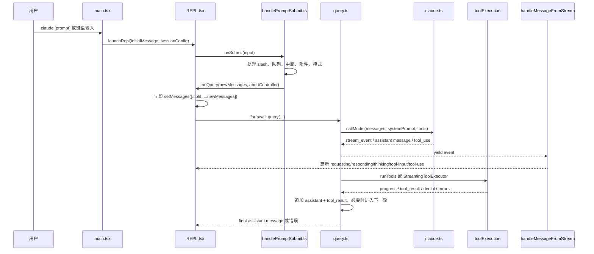
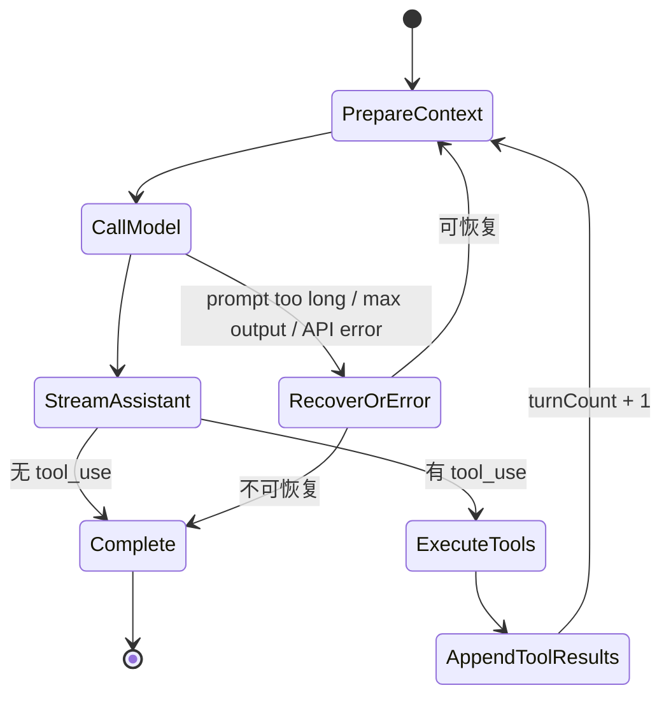
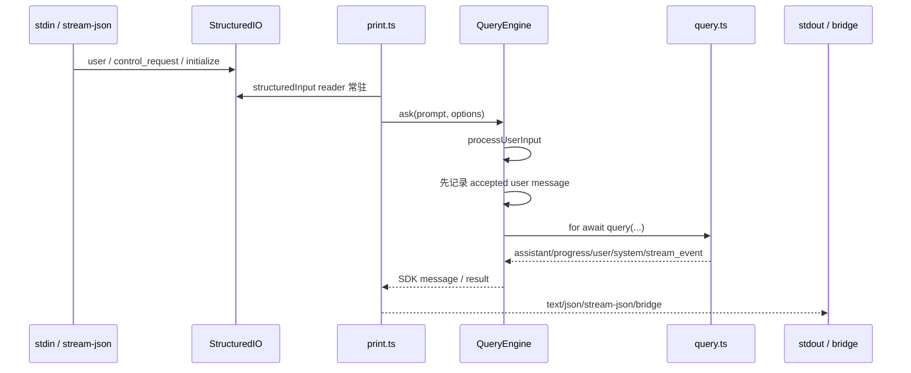
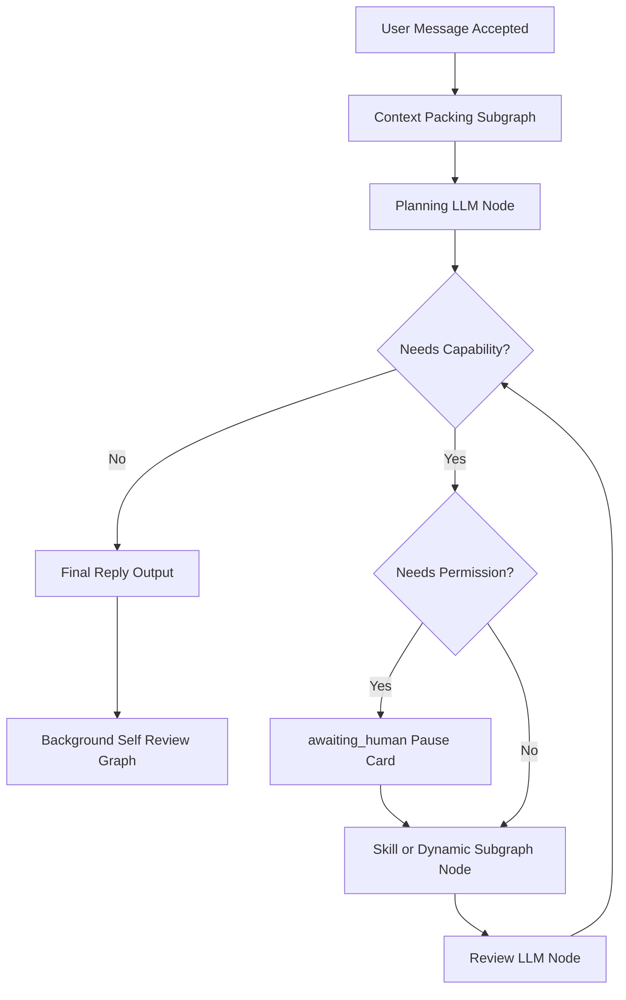

# Claude Code 消息循环源码参考

本文基于本仓库内 `demo/claude-code-source/` 的本地源码整理，版本来自 `demo/claude-code-source/package.json`：`@anthropic-ai/claude-code` `2.1.88`。

这份文档只把 Claude Code 当作能力参考。TooGraph 不应复制它的隐藏 Agent 运行时，而应把可借鉴机制翻译为图模板、显式状态、运行事件、权限暂停、审计记录和可恢复的 Buddy 流程。

## 关键结论

1. Claude Code 的交互路径把“收到用户消息”和“执行长任务”拆开了。REPL 会先把用户消息加入 UI 状态，然后再准备上下文、模型请求、工具循环和持久化。
2. 核心 Agent 循环是一个 async generator：`query()` 持续产出消息、原始 stream event、工具进度、tool result、错误和 tombstone，UI 和 headless 输出都按事件增量消费。
3. 模型回复和工具执行是成对推进的：模型流中出现 `tool_use` 后，运行时要么边流式接收边启动工具，要么在本次模型流结束后批量执行工具，再把 tool result 追加回消息历史进入下一轮模型调用。
4. 权限不是写在模型循环里的 prompt 约束，而是工具执行前的显式 runtime 决策：hook、schema 校验、权限模式、交互弹窗、stdio permission prompt 或拒绝结果都会留下可观察路径。
5. 交互式 REPL 的 transcript 持久化是尾部增量记录。headless/SDK 路径会在模型响应前先记录被接受的用户消息，保证中途退出后还能恢复。
6. 本地源码没有看到一个简单的“总运行时长到点就失败”的 Agent 总超时。存在的是 `maxTurns`、token budget、prompt too long 恢复、可选 stream idle watchdog、SIGINT/AbortController、中断控制和部分等待策略。
7. TooGraph 可以借鉴它的快速反馈体验：先确认用户消息进入运行，再用事件流持续展示请求、思考、文本、工具输入、工具进度、权限请求和最终回复。

## 源码地图

| 职责 | 主要文件 |
| --- | --- |
| CLI 参数、启动模式、初始消息、resume/continue/headless 分流 | `demo/claude-code-source/src/main.tsx` |
| Ink 应用装载 | `demo/claude-code-source/src/replLauncher.tsx` |
| 交互式 REPL、输入提交、查询启动、事件消费 | `demo/claude-code-source/src/screens/REPL.tsx` |
| 用户输入归一化、排队、中断、slash command 处理入口 | `demo/claude-code-source/src/utils/handlePromptSubmit.ts` |
| 核心 Agent 循环、上下文压缩、模型调用、工具循环 | `demo/claude-code-source/src/query.ts` |
| `query()` 的生产依赖注入 | `demo/claude-code-source/src/query/deps.ts` |
| Anthropic Messages API 流式调用和事件规整 | `demo/claude-code-source/src/services/api/claude.ts` |
| stream event 到 UI 状态的映射 | `demo/claude-code-source/src/utils/messages.ts` |
| 工具编排、并发和串行策略 | `demo/claude-code-source/src/services/tools/toolOrchestration.ts` |
| 流式工具执行器 | `demo/claude-code-source/src/services/tools/StreamingToolExecutor.ts` |
| 单个工具调用、hook、权限、结果映射 | `demo/claude-code-source/src/services/tools/toolExecution.ts` |
| 交互式权限决策 | `demo/claude-code-source/src/hooks/useCanUseTool.tsx` |
| transcript 增量记录 | `demo/claude-code-source/src/hooks/useLogMessages.ts`、`demo/claude-code-source/src/utils/sessionStorage.ts` |
| headless/SDK 输入输出和 permission stdio | `demo/claude-code-source/src/cli/structuredIO.ts` |
| headless 主循环 | `demo/claude-code-source/src/cli/print.ts` |
| SDK/headless 查询生命周期 | `demo/claude-code-source/src/QueryEngine.ts` |

## 交互式消息完整链路



### 1. CLI 启动和初始消息

`src/main.tsx` 用 Commander 定义 `claude [prompt]`，同时支持 `--print`、`--output-format`、`--input-format`、`--continue`、`--resume`、`--model`、`--permission-mode`、`--allowed-tools`、`--disallowed-tools`、`--session-id`、`--no-session-persistence` 等参数。

交互式启动时，`main.tsx` 会构造 `sessionConfig` 和初始 UI 状态。如果命令行传入了 prompt，会生成：

```ts
initialMessage: inputPrompt
  ? { message: createUserMessage({ content: String(inputPrompt) }) }
  : null
```

随后进入 `launchRepl(...)`。如果是 `--continue` 或 `--resume`，启动参数会带上历史 `initialMessages`、file snapshot、content replacement 和恢复出的 agent 配置。

### 2. `launchRepl` 只负责装载 UI

`src/replLauncher.tsx` 的职责很薄：动态导入 `App` 和 `REPL`，然后渲染：

```tsx
<App {...appProps}>
  <REPL {...replProps} />
</App>
```

真正的消息输入、查询启动、状态更新都在 `REPL.tsx`。

### 3. `REPL` 接收初始消息或键盘输入

`src/screens/REPL.tsx` 里有两条进入同一套执行链路的路径：

1. 初始消息：`initialMessage` effect 等待 UI 和 hook 准备完成后，把字符串 prompt 交给 `onSubmit(...)`。复杂消息或 plan message 会直接走 `onQuery(...)`。
2. 键盘输入：输入框提交后触发 `onSubmit(...)`。

`onSubmit` 做几件关键事情：

- 处理交互式 slash command。
- 把输入加入本地历史。
- 在 prompt 模式下清空可见输入框，并用 `setUserInputOnProcessing(input)` 保留“正在处理的用户输入”占位。
- 等待 pending hook。
- 调用 `handlePromptSubmit(...)`。

这个设计让 UI 不必等模型请求完成才承认用户消息，体验上会更快。

### 4. `handlePromptSubmit` 做输入归一化和排队

`src/utils/handlePromptSubmit.ts` 是用户输入进入 Agent 前的整理层。

主要行为：

- 空输入直接返回。
- `exit`、`quit` 等被转为 `/exit`。
- 处理粘贴文件引用和附件。
- 查询正在运行时，新输入进入队列，而不是直接启动第二个查询。
- 如果当前运行中的工具都可中断，可以触发 abort，让新输入尽快接管。
- 空闲时调用 `executeUserInput(...)`。

`executeUserInput(...)` 会创建 `AbortController`，通过 `QueryGuard` 预留当前查询，把输入交给 `processUserInput(...)` 处理成 `newMessages`、`shouldQuery`、临时允许工具、模型和 effort，然后调用：

```ts
onQuery(newMessages, abortController, shouldQuery, allowedTools, model, onBeforeQuery, primaryInput, effort)
```

### 5. `REPL.onQuery` 立即显示用户消息，再启动 Agent 循环

`REPL.onQuery` 是交互体验的关键点。

它会先做并发保护。如果已有运行，消息会进队列。否则它先执行：

```ts
setMessages(oldMessages => [...oldMessages, ...newMessages])
```

然后才准备 IDE 上下文、标题、工具权限、system prompt、user context、system context 和 `ToolUseContext`，最后开始：

```ts
for await (const event of query({...})) {
  onQueryEvent(event)
}
```

这解释了为什么 Claude Code 可以做到“用户消息很快出现，然后动作继续流式展示”：消息确认和模型/工具执行不是同一个阻塞动作。

## 核心 Agent 循环

`src/query.ts` 的 `query()` 是核心 async generator。它包装 `queryLoop(...)`，不断 yield 可被 UI、headless 或 SDK 消费的事件。

### 单轮循环结构

每一轮大致是：

1. 初始化或继承 `State`：消息、工具上下文、turn count、压缩状态、恢复状态。
2. 启动 memory 和 skill 的预取。
3. yield `stream_request_start`，让 UI 进入请求中状态。
4. 从压缩边界之后取 `messagesForQuery`。
5. 应用 tool result budget，必要时 snip、microcompact、context collapse、autocompact。
6. 组装 `fullSystemPrompt = appendSystemContext(systemPrompt, systemContext)`。
7. 更新 `toolUseContext.messages`。
8. 调用模型流。
9. 收集 assistant message、`tool_use`、usage、stream event 和错误。
10. 没有 tool use 时，处理 stop hook、max token、prompt too long、预算和最终完成。
11. 有 tool use 时，执行工具，把 tool result 追加到消息历史，进入下一轮。

简化成状态机：



### 模型调用和流式事件

`src/query/deps.ts` 的 `productionDeps()` 把 `callModel` 绑定到 `queryModelWithStreaming(...)`。

`src/services/api/claude.ts` 的职责包括：

- 规范化消息。
- 保证 `tool_use` 和 `tool_result` 的配对。
- 组装 system prompt、tool schema、model、thinking、max tokens、metadata、context management、cache breakpoint 等 API 参数。
- 调用 Anthropic Messages API 的 streaming 接口。
- 解析 `message_start`、`content_block_start`、`content_block_delta`、`content_block_stop`、`message_delta` 等事件。
- 累积 text、thinking、tool input JSON 和 tool use block。
- 产出上层统一的 assistant message 和低层 `stream_event`。

`src/utils/messages.ts` 的 `handleMessageFromStream(...)` 再把这些事件映射成 UI 状态：

- `stream_request_start`：请求中。
- `message_start`：记录 metrics。
- `content_block_start` 的 text/thinking/tool_use：进入 responding/thinking/tool-input。
- `content_block_delta` 的 text_delta：追加正在流式显示的文本。
- `input_json_delta`：追加工具输入片段。
- `message_stop`：切换到 tool-use 阶段。
- 普通 assistant/user/system/progress/tombstone message：追加、删除或更新消息列表。

TooGraph 需要的不是完全一样的 API 事件类型，而是同样的“运行事件层”：模型请求开始、文本增量、思考片段、工具输入片段、权限等待、工具进度、工具结果、最终回复都应该能作为 run event 被观察。

## 工具调用和权限链路

### 1. 工具使用来自模型的 `tool_use`

`queryLoop(...)` 在模型流中看到 assistant content block 的 `tool_use` 后，会把它加入 `toolUseBlocks`，并设置 `needsFollowUp = true`。

如果启用了流式工具执行，`StreamingToolExecutor` 可以在工具输入流完并满足执行条件后提前启动工具。否则 `queryLoop` 会等模型流结束，再调用 `runTools(...)`。

### 2. 工具编排区分安全并发和串行执行

`src/services/tools/toolOrchestration.ts` 的 `runTools(...)` 会把工具调用分组：

- 连续的 concurrency-safe 工具可以并发执行。
- 非 concurrency-safe 工具串行执行。
- 并发批次执行完后再应用 context modifier，避免并发工具互相污染上下文。

`CLAUDE_CODE_MAX_TOOL_USE_CONCURRENCY` 可以控制并发上限，默认值是 10。

### 3. `StreamingToolExecutor` 支持边流式接收边执行

`src/services/tools/StreamingToolExecutor.ts` 封装了更激进的执行方式：

- `addTool(...)` 接收一个已经流完输入的 tool use。
- `processQueue(...)` 根据并发限制和工具安全性启动可执行工具。
- `executeTool(...)` 调用 `runToolUse(...)`，把 progress 暂存为可立即 yield 的消息。
- `getCompletedResults(...)` 既能先吐 progress，又能保持最终 tool result 顺序。
- Bash 工具出错时，可以 abort 兄弟 Bash 工具。
- 当所有执行中的工具都可取消时，会更新 `hasInterruptibleToolInProgress`，供外部输入打断。

这说明“工具进度”和“最终 tool result”本来就是两类事件。TooGraph 的 Buddy 运行记录也应该这样拆开，而不是只在最后显示一次汇总。

### 4. 单个工具调用包含 hook、权限和结果映射

`src/services/tools/toolExecution.ts` 的 `runToolUse(...)` 和 `checkPermissionsAndCallTool(...)` 是单个工具调用的核心。

大致步骤：

1. 找到工具定义，处理缺失工具和别名。
2. 如果已经 abort，返回取消型 `tool_result`。
3. 校验输入 schema。
4. 调用工具自己的 `validateInput(...)`。
5. 启动 Bash speculative classifier。
6. 做 input preprocess 和 backfill。
7. 运行 `PreToolUse` hooks。hook 可以阻止、改写输入、附加上下文或给出权限结果。
8. 解析权限。可能直接 allow、deny，或者进入交互式权限确认。
9. deny 时生成拒绝型 `tool_result`，必要时运行 `PermissionDenied` hooks。
10. allow 时调用 `tool.call(...)`，progress callback 产生进度消息。
11. 把工具输出映射成 `tool_result`，并记录到 tool context。
12. 运行 `PostToolUse` hooks。
13. 返回 tool result、额外消息、MCP result 或 hook stop continuation。

### 5. 交互式权限由 `useCanUseTool` 负责

`src/hooks/useCanUseTool.tsx` 生成 `CanUseToolFn`。

它会调用权限系统判断工具是否可用：

- allow：直接返回允许结果。
- deny：记录拒绝并返回拒绝。
- ask：根据环境选择 coordinator、swarm worker、Bash speculative classifier 或交互式 permission UI。

UI 组件在 `src/components/permissions/PermissionRequest.tsx` 会按工具类型选择不同权限请求视图，例如文件编辑、文件写入、Bash、WebFetch 等。

对 TooGraph 来说，这个机制应该翻译为图运行中的 `awaiting_human` 暂停卡和低层 permission request，而不是隐藏在 Buddy prompt 中。

## 结束、恢复和下一轮

`queryLoop(...)` 没有工具调用时，会进入完成路径：

- prompt too long 时尝试 reactive compact 或其他恢复。
- max output token 时可能请求继续或升级。
- API error 时产出错误并完成。
- 运行 stop hooks。
- 检查 token budget continuation。
- 最终返回 completed。

有工具调用时，会进入下一轮路径：

- 执行工具并 yield progress/tool result。
- 生成工具摘要，部分情况下后台执行。
- 如果 abort，补齐缺失 tool result，保证消息结构合法。
- 处理 queued command 和附件。
- 消费 memory prefetch、skill prefetch。
- 刷新工具列表。
- 检查 `maxTurns`。
- 把 `messagesForQuery + assistantMessages + toolResults` 写入下一轮 state。

这是一种“模型一轮只产出一步能力调用，工具结果回填后再由模型决定下一步”的循环。TooGraph 的图模板可以用 LLM 节点、条件节点、Skill 或动态 Subgraph 节点、result_package state、review 节点和循环边来表达同样能力。

## headless 和 SDK 链路

Claude Code 的非交互路径和 REPL 不是同一套 UI，但核心仍复用 `query(...)`。



### 1. `main.tsx` 的 `--print` 分支

`main.tsx` 在 `--print` 模式下不会启动 Ink REPL，而是导入 `src/cli/print.ts` 并调用 `runHeadless(...)`。启动前会准备工具、MCP、hook、telemetry、session 等配置。

### 2. `StructuredIO` 管理结构化输入输出

`src/cli/structuredIO.ts` 的 `StructuredIO` 支持：

- 从 stdin 或 AsyncIterable 读取 `stream-json`。
- 解析 `user`、`assistant`、`system`、`control_request`、`control_response`、`initialize` 等结构化消息。
- 用单一 outbound writer 防止 control request 被 stream event 乱序超过。
- 在 stdio 权限模式下创建 `canUseTool`，把权限请求发给外部控制端，再等待 `control_response`。

### 3. `runHeadlessStreaming` 并行读输入、跑查询、写输出

`src/cli/print.ts` 的 `runHeadless(...)` 创建 `StructuredIO`，再进入 `runHeadlessStreaming(...)`。

这个路径里有一个独立 stdin reader task，持续消费 `structuredInput`：

- `interrupt` control request 可以 abort 当前 turn。
- `end_session` 可以终止会话。
- `initialize` 更新初始化状态。
- 用户消息会进入消息队列。

主循环则从队列取输入，创建 `AbortController`，调用 `ask(...)` 或 `QueryEngine`，把中间事件增量写到 stdout、bridge 或 stream-json。

### 4. `QueryEngine` 负责 SDK/headless 的一次查询生命周期

`src/QueryEngine.ts` 的 `submitMessage(...)` 做了 headless/SDK 版本的查询生命周期管理：

- 包装 `canUseTool`，跟踪权限拒绝。
- 准备模型、system prompt、user context、system context。
- 调用 `processUserInput(...)`。
- 把用户消息加入 `mutableMessages`。
- 在第一次 API 响应前记录 accepted user message，保证会话可恢复。
- 调用 `query(...)`。
- 对 `query(...)` 的 assistant、progress、user、attachment、system、stream event、tool summary 做 SDK 输出规整。
- 根据停止原因产出 success、error、max_turns、structured output 等最终 result。

交互式 REPL 更强调 UI 状态，QueryEngine 更强调协议输出和恢复能力，但两者共享核心 Agent 循环。

## 持久化和恢复

交互式路径的持久化主要经过 `src/hooks/useLogMessages.ts`：

- 监听 `messages`。
- 只记录新增尾部消息。
- 如果检测到 compact 后的数组替换，则改为记录完整新数组。
- 调用 `recordTranscript(...)` 是 fire-and-forget，不阻塞 UI 流。

`src/utils/sessionStorage.ts` 定义 transcript 消息类型。当前 schema 中 `user`、`assistant`、`attachment`、`system` 是 transcript message，progress 不是正式 transcript message，更偏 UI 运行态。

headless/SDK 的 `QueryEngine` 会更早记录用户消息。它在模型调用前把 accepted user message 写入 transcript，这是为了进程在模型返回前被杀掉时，用户输入仍然可恢复。

TooGraph 可以借鉴这个分层：

- 用户输入、最终回复、审批、工具结果属于可恢复运行记录。
- 高频进度、流式 token、临时状态可以作为 `activity_events` 或 run event 保存，是否进入长期 transcript 要有明确策略。
- 对文件写入、图修改、memory 更新这类副作用，应该额外有 artifact、diff、revision ID 或 undo 记录。

## 关于速度和“先回复再动作”

源码显示 Claude Code 的快速响应体验主要来自几个工程选择：

1. 用户消息先进入 UI 状态，后续模型和工具准备不阻塞消息确认。
2. 模型调用是流式的，低层 stream event 会持续更新 UI 状态。
3. 工具输入 JSON 也按 delta 展示，用户能看到“正在准备调用什么”。
4. 工具执行有 progress message，不必等所有工具结束。
5. transcript 记录采用增量和部分 fire-and-forget，避免每条 UI 更新都等待磁盘。
6. headless/SDK 路径也把输入读取、控制请求、查询执行和输出写入拆成并行/增量过程。

TooGraph 可以做到类似体验，但需要避免把“快速”做成隐藏副作用。建议拆成：

- `user_message.accepted`：用户消息进入当前 Buddy run。
- `run.activity`：模型请求、上下文加载、图节点开始/结束、工具输入、权限等待、工具进度。
- `assistant.partial`：流式文本。
- `capability.result`：Skill/Subgraph 的结构化结果。
- `final_reply`：本轮唯一用户可见最终回复。
- `background_review.started/completed`：最终回复后的后台复盘，不阻塞下一次用户输入。

这样 Buddy 的运行过程和最终回复可以成对出现，同时下一轮用户输入不必等后台复盘完成。

## 对 TooGraph/Buddy 的可借鉴点

### 应该借鉴

1. 消息接收和长任务执行解耦。先创建 run、记录用户消息、返回可观察状态，再推进图执行。
2. 所有执行阶段都通过事件流输出，而不是等最终回复。
3. 工具进度和工具最终结果分开建模。
4. 权限请求是 runtime 事件，可暂停、恢复、拒绝、记录。
5. 用户输入排队和中断要有明确状态，而不是让多轮输入抢同一个运行上下文。
6. transcript 和 activity event 分层，避免把高频临时流式状态混进长期记忆。
7. 没有必要设置固定总时长失败。更合理的是 idle watchdog、用户可取消、可恢复 run、max turn/token budget、节点级失败和清晰错误状态。
8. headless/SDK 的 `control_request/control_response` 思路可以翻译成 TooGraph 的 `awaiting_human` pause/resume 卡。

### 不应照搬

1. 不应把 Buddy 做成一个隐藏 `while` 循环。TooGraph 的多步智能应表达为图模板、节点、边、state schema 和 run record。
2. 不应让单个 Skill 承担多轮自治、记忆策略、复盘和最终回复。Skill 应是一次受控能力调用。
3. 不应把权限靠 prompt 约束解决。文件写入、脚本执行、网络访问、图修改都需要可审计 permission path。
4. 不应把后台复盘接在用户可见回复路径后继续阻塞。复盘应从完成的 run snapshot 启动为单独后台图。
5. 不应把 progress 全部写入长期记忆。需要区分运行审计、artifact、session summary 和 Buddy Home 长期资料。

## 建议的 Buddy 图循环映射

Claude Code 的源码可以映射成 TooGraph 的 graph-first 结构：

| Claude Code 概念 | TooGraph/Buddy 映射 |
| --- | --- |
| `onSubmit` / `handlePromptSubmit` | Buddy 输入节点和 request intake 子图 |
| `QueryGuard` / message queue | run coordinator、用户输入排队、中断和恢复状态 |
| `query()` async generator | 图运行事件流和节点执行器 |
| `stream_request_start` / `stream_event` | 统一 `activity_events` |
| `tool_use` | LLM 节点产出的单个 capability 调用计划 |
| `runTools` / `StreamingToolExecutor` | Skill/Subgraph 节点执行器 |
| `canUseTool` | 图运行 permission request / `awaiting_human` |
| `tool_result` | schema-backed state 或 `result_package` |
| 下一轮 `messagesForQuery + toolResults` | 图边回到 review/planning LLM 节点 |
| `useLogMessages` / transcript | run record、conversation transcript、artifact 记录 |
| `QueryEngine` | headless/API 模式的 Buddy run controller |

推荐的 Buddy 可见路径：



这个结构保留 Claude Code 的能力循环，但仍符合 TooGraph 的协议边界：一个 LLM 节点只做一次模型回合，一个 Skill 只做一次受控能力调用，多步智能由图边和状态推进。

## 对当前 Buddy 设计的直接启发

1. Buddy 的运行记录应该以 turn 为单位成对展示：每条用户消息对应一个 run，每个 run 有活动事件和一个最终 `final_reply`。
2. 暂停后继续运行不需要多个输入框。UI 应复用标准 `awaiting_human` 卡：显示已产出内容、当前上下文、需要用户补充或批准的单个输入区域，以及可选的几个操作按钮。
3. 用户补充内容应作为 pause/resume event 进入同一个 run，或者明确创建下一轮 run，不能变成漂浮在多个输入框里的隐式状态。
4. 运行时长不应是单个硬限制。应有节点级 idle 检测、手动取消、恢复入口、最大轮数、token budget 和可解释失败原因。
5. Buddy 回复可以先流式出现，后台自我复盘和 memory/evolution candidate 生成应另起后台图，不阻塞用户下一条消息。
6. 低层活动事件应统一，文件读写、脚本执行、网络、图修改、memory 写回都通过同一种 run audit 表达。
7. Hermes-style autonomy 和 Claude-style tool loop 都可以作为参考，但 TooGraph 的实现核心仍是模板、state、Skill/Subgraph、权限和审计。
