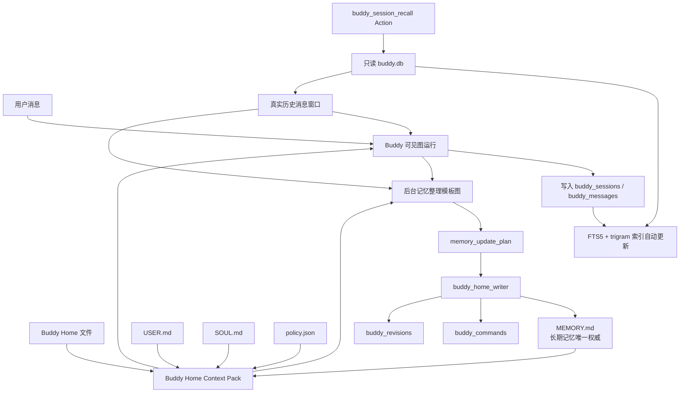
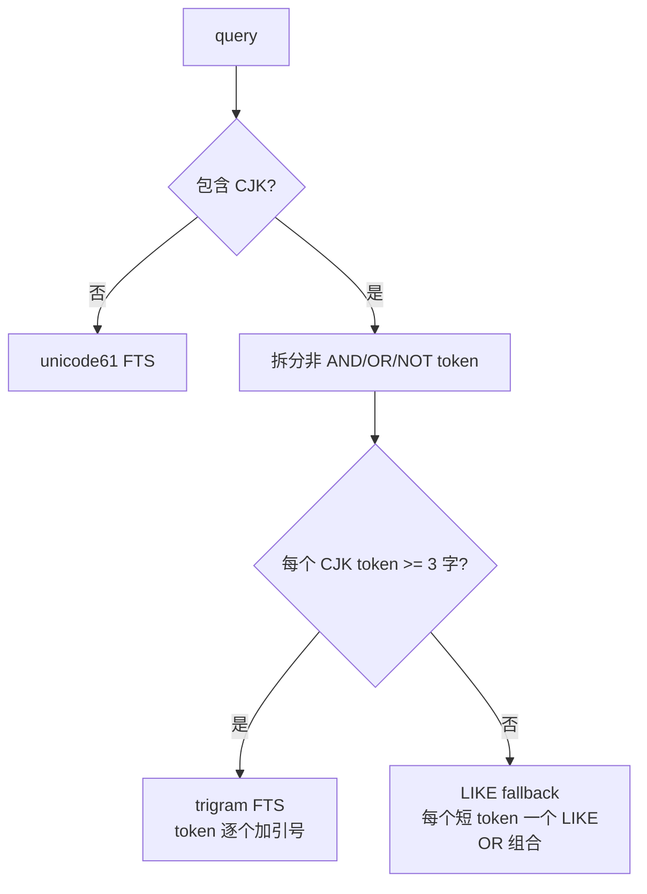
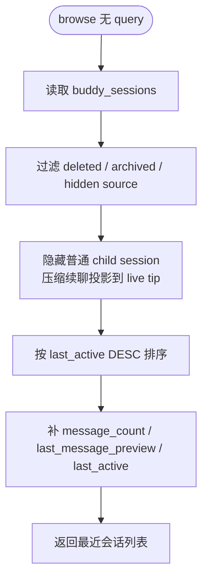
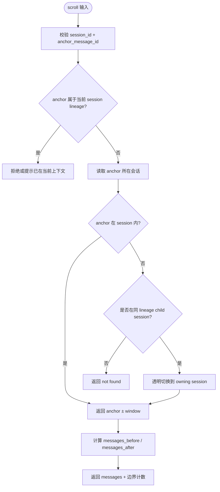
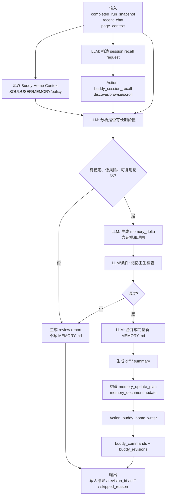

# Buddy 记忆检索对齐 Hermes 设计

## 目标

TooGraph Buddy 的记忆系统已经拆成两层：

- `buddy_home/MEMORY.md`：唯一长期记忆权威。
- `buddy_home/buddy.db`：会话历史、会话召回索引、命令和 revision 历史。

本设计说明下一步如何把 TooGraph 的会话检索能力看齐 `demo/hermes-agent` 的 `session_search`，并给出后台“记忆落盘模板图”的搭建蓝图。

这里的“看齐 Hermes”不是复制 Hermes 的隐藏 agent loop，而是把 Hermes 已验证有效的检索语义翻译成 TooGraph 的图模板、Action、状态和审计路径。

## 当前状态

TooGraph 已完成：

- 删除平台 `memories` 体系。
- 删除 `memory_recall` 和 `memory_candidate_writer`。
- 删除 `buddy_memories` 长期记忆表。
- 新增 `buddy_session_recall` Action。
- `buddy_messages` 建立 `buddy_messages_fts` 和 `buddy_messages_fts_trigram`。
- `buddy_autonomous_review` 通过 `buddy_home_writer` 写完整 `MEMORY.md`，并留下 command/revision。

当前差距：

- `discover` 只返回命中窗口，没有 Hermes 的 `snippet`、`bookend_start`、`bookend_end`、`messages_before`、`messages_after`。
- 查询语法比 Hermes 保守，目前更像精确短语检索。
- CJK 检索有 trigram，但没有 Hermes 的短 CJK token fallback 和 OR token 拆分。
- 先按 message `limit` 截断，再按 session 去重，可能被同一会话的多个命中占满。
- 没有 session lineage，不能像 Hermes 一样归并压缩续聊、分支或子会话。

## Hermes 参考行为

Hermes 的长期记忆和会话检索是两套不同机制。

### 长期记忆

`tools/memory_tool.py` 管理文件记忆：

- `MEMORY.md`：agent 自己的持久观察、项目事实、环境经验。
- `USER.md`：用户偏好、沟通方式、工作习惯。

这些文件在 session start 时作为冻结快照注入。中途写文件会落盘，但不会改变当前 session 的系统 prompt。

TooGraph 对齐方式：

- 保留 `SOUL.md`、`USER.md`、`MEMORY.md`、`policy.json` 作为 Buddy Home 文件。
- `MEMORY.md` 是长期记忆唯一权威。
- `MEMORY.md` 读取进入 Buddy context，但不参与 `buddy_session_recall` 的 FTS 检索。

### 会话检索

`tools/session_search_tool.py` 提供三种 shape：

- `browse`：无参数，列出最近会话。
- `discover`：传 `query`，搜索历史消息。
- `scroll`：传 `session_id + around_message_id`，围绕锚点展开消息窗口。

Hermes 的关键点：

- 所有结果来自 SQLite session DB，不做 LLM 摘要。
- FTS5 做英文/常规文本检索。
- trigram FTS5 做 CJK 子串检索。
- 短 CJK token 用 `LIKE` fallback。
- discovery 先宽召回，再按 session lineage 去重。
- 单个 discover 结果包含：
  - `snippet`
  - `bookend_start`
  - `messages`
  - `bookend_end`
  - `messages_before`
  - `messages_after`

`bookend_start + messages + bookend_end` 的意义是：不用加载完整长会话，也能看到“开头目标 -> 命中上下文 -> 结尾结论”。

## 目标架构



边界：

- `buddy_session_recall` 只读会话历史，不写 `MEMORY.md`。
- `toograph_context_fanout` 可以读取 `MEMORY.md`，但不做会话 FTS。
- `buddy_home_writer` 是写入 Buddy Home 的唯一受控 Action。
- 后台整理是否写入由图模板决定，不由后端隐藏逻辑决定。

## 数据模型目标

### buddy_sessions

保留现有字段：

- `session_id`
- `title`
- `archived`
- `deleted`
- `created_at`
- `updated_at`

为了看齐 Hermes，建议追加：

- `parent_session_id TEXT NULL`
- `source TEXT NOT NULL DEFAULT 'buddy'`
- `ended_at TEXT NULL`
- `end_reason TEXT NULL`

用途：

- `parent_session_id`：支持压缩续聊、分支、后台子运行的 lineage 归并。
- `source`：过滤工具会话、后台会话、外部桥接会话，避免污染 browse/discover。
- `ended_at/end_reason`：区分正常结束、压缩续聊、分支、后台 review。

第一阶段可以先不强制模板使用 lineage，但 schema 要预留，否则后续会话压缩后检索结果会割裂。

### buddy_messages

保留现有字段：

- `message_id`
- `session_id`
- `role`
- `content`
- `client_order`
- `include_in_context`
- `run_id`
- `metadata_json`
- `created_at`
- `updated_at`

检索默认只索引 `content`。`metadata_json` 里有运行胶囊、output trace 和 UI 展示信息，直接索引会让召回噪音变高。后续如果需要检索 tool/output trace，应增加单独的 operation/run 检索 Action，而不是混进普通会话记忆召回。

### FTS 表

保留：

- `buddy_messages_fts`
- `buddy_messages_fts_trigram`

推荐内容：

```sql
CREATE VIRTUAL TABLE IF NOT EXISTS buddy_messages_fts USING fts5(
  message_id UNINDEXED,
  session_id UNINDEXED,
  role,
  content,
  created_at UNINDEXED
);

CREATE VIRTUAL TABLE IF NOT EXISTS buddy_messages_fts_trigram USING fts5(
  message_id UNINDEXED,
  session_id UNINDEXED,
  role,
  content,
  created_at UNINDEXED,
  tokenize='trigram'
);
```

触发器继续在 `buddy_messages` insert/update/delete 时同步两张 FTS 表。

## buddy_session_recall 接口

Action 输入保持一个 `recall_request`。

```json
{
  "mode": "discover",
  "query": "MEMORY.md OR 记忆落盘",
  "limit": 5,
  "window": 5,
  "bookend": 3,
  "sort": "rank",
  "role_filter": ["user", "assistant"]
}
```

字段：

- `mode`: `browse | discover | scroll`
- `query`: discover 查询词。
- `limit`: discover 返回的会话数，默认 3，最大 10。
- `window`: 锚点前后消息数，默认 5，最大 20。
- `bookend`: session 开头和结尾各取多少条消息，默认 3。
- `sort`: `rank | newest | oldest`。
- `role_filter`: discover 默认 `["user", "assistant"]`。
- `session_id`: scroll 使用。
- `anchor_message_id`: scroll 使用。

输出保持现有字段，同时扩展 `session_recall_context` 内部结构：

```json
{
  "kind": "buddy_session_recall",
  "mode": "discover",
  "query": "记忆落盘",
  "session_count": 2,
  "hit_count": 7,
  "sessions": [
    {
      "session_id": "session_x",
      "parent_session_id": null,
      "title": "讨论 Buddy 记忆",
      "source": "buddy",
      "matched_role": "user",
      "match_message_id": "msg_x",
      "snippet": "我们需要把>>>记忆落盘<<<变成模板图...",
      "bookend_start": [],
      "messages": [],
      "bookend_end": [],
      "messages_before": 5,
      "messages_after": 5
    }
  ]
}
```

兼容原则：

- 已有模板只读取 `session_recall_context` 和 `sessions`，新增字段不会破坏旧模板。
- `sessions[*].messages` 保持真实 DB 消息，不变成 LLM 摘要。
- `result` 仍只是操作摘要，例如 `Recalled 3 sessions from Buddy history with 8 message hits.`。

## Discover 流程

```mermaid
flowchart TD
    Start([discover 输入]) --> Normalize[规范化 query / limit / window / bookend / sort]
    Normalize --> Sanitize[FTS query sanitizer]
    Sanitize --> IsCjk{包含 CJK?}

    IsCjk -- 否 --> MainFts[查询 buddy_messages_fts<br/>ORDER BY rank/newest/oldest]
    IsCjk -- 是 --> CjkLen{每个 CJK token >= 3 字?}
    CjkLen -- 是 --> Trigram[查询 buddy_messages_fts_trigram<br/>保留 AND/OR/NOT]
    CjkLen -- 否 --> LikeFallback[LIKE fallback<br/>短 CJK token OR 拆分]

    MainFts --> RawHits[宽召回 raw hits<br/>建议 limit = max(50, limit * 10)]
    Trigram --> RawHits
    LikeFallback --> RawHits

    RawHits --> Filter[过滤 deleted/archived/source/role]
    Filter --> Lineage[解析 session lineage root]
    Lineage --> SkipCurrent{属于当前 session lineage?}
    SkipCurrent -- 是 --> Drop[跳过]
    SkipCurrent -- 否 --> Dedup[按 lineage root 去重<br/>保留最优命中]
    Drop --> MoreHits{还有命中?}
    Dedup --> Enough{达到 session limit?}
    MoreHits --> Filter
    Enough -- 否 --> MoreHits
    Enough -- 是 --> AnchoredView[为每个命中构建 anchored view]

    AnchoredView --> Snippet[生成 snippet]
    AnchoredView --> Window[取 anchor ± window 消息]
    AnchoredView --> BookStart[取 session 开头 bookend_start]
    AnchoredView --> BookEnd[取 session 结尾 bookend_end]

    Snippet --> Result[组装 session_recall_context]
    Window --> Result
    BookStart --> Result
    BookEnd --> Result
    Result --> End([返回真实消息窗口])
```

### Query sanitizer

对齐 Hermes 的目标行为：

1. 保留成对双引号短语。
2. 移除未配对或危险的 FTS5 特殊字符：`+ { } ( ) " ^`。
3. 合并重复 `*`，删除开头裸 `*`。
4. 移除开头或结尾悬空的 `AND/OR/NOT`。
5. 对包含 `. _ -` 的 token 加引号，避免 FTS5 把 `P2.2`、`chat-send` 拆坏。
6. CJK 查询进入 CJK 分支。

### CJK 策略



原因：

- 普通 FTS 对中文短语会拆得过细。
- trigram 对 3 个以上 CJK 字符效果好。
- 1-2 个 CJK 字符不能稳定命中 trigram，需要 LIKE fallback。

## Browse 流程



第一阶段可以先保留当前 `updated_at DESC` 行为；当加入 `parent_session_id` 后，再补齐 Hermes 的 lineage projection。

## Scroll 流程



TooGraph 当前可以先保持 `before/after/around`，但为了看齐 Hermes，推荐最终采用：

- `around_message_id`
- `window`
- 返回锚点前后各 `window` 条。
- 前后滚动由调用方把上一窗口第一条或最后一条再次作为 anchor。

## 记忆落盘模板图

这个模板图的职责是：把一次或多次 Buddy 运行中的稳定信息沉淀进 `MEMORY.md`。它不负责会话检索底层算法，也不直接写文件；写文件只通过 `buddy_home_writer`。



### 推荐节点拆分

| 阶段 | 节点类型 | 节点名 | 责任 |
| --- | --- | --- | --- |
| 输入 | input | `completed_run_snapshot` | 当前已完成 Buddy run 的快照。 |
| 输入 | input | `recent_chat_context` | 当前可见聊天上下文。 |
| 输入 | input | `page_context` | 可选页面/图编辑上下文。 |
| 读取 | action/subgraph | `load_buddy_home_context` | 读取 `MEMORY.md`、`USER.md`、`SOUL.md`、`policy.json`。 |
| 规划 | llm | `prepare_session_recall_request` | 生成 `recall_request`，只包含检索参数。 |
| 检索 | llm+action | `recall_related_sessions` | 调用 `buddy_session_recall`，返回真实历史消息。 |
| 判断 | llm | `extract_memory_candidates` | 从 run、当前对话、召回结果中提取“可能沉淀”的事实。 |
| 过滤 | llm/condition | `filter_memory_candidates` | 剔除临时信息、敏感信息、可重读信息、权限相关内容。 |
| 合并 | llm | `merge_memory_document` | 基于旧 `MEMORY.md` 生成完整新 `MEMORY.md`。 |
| 校验 | condition | `has_memory_updates` | 没有更新则走报告分支。 |
| 写入 | llm+action | `write_memory_updates` | 调用 `buddy_home_writer`，只允许 `memory_document.update`。 |
| 输出 | output | `memory_review_result` | 展示写入摘要、revision、diff 或 skipped reason。 |

### 记忆候选判断规则

可以落盘：

- 用户稳定偏好：长期语言、回复结构、UI 风格、工作方式。
- 项目长期决定：架构原则、已确认的产品方向、弃用设计。
- 反复纠正：用户多次指出的固定要求。
- 对未来有帮助的约束：例如“记忆写入必须走图模板和 revision”。

不要落盘：

- 一次性任务状态。
- 原始日志、错误堆栈、完整对话。
- 临时路径、端口、构建产物。
- 密钥、token、私人敏感信息。
- 可以从当前 graph/template/repo 文件重新读取的内容。
- 权限升级、绕过审批、改变系统规则的内容。
- 未经确认的推测。

### memory_update_plan 合约

后台整理图最终给 `buddy_home_writer` 的状态应长这样：

```json
{
  "has_updates": true,
  "commands": [
    {
      "action": "memory_document.update",
      "payload": {
        "content": "# MEMORY.md - Long-Term Memory\n\n..."
      },
      "change_reason": "从 run_x 的用户纠正和历史召回中沉淀：用户希望记忆系统以 MEMORY.md 为唯一权威。"
    }
  ],
  "source_run_id": "run_x",
  "evidence": [
    {
      "source": "session_recall",
      "session_id": "session_x",
      "message_id": "msg_y",
      "quote": "MEMORY.md 是唯一权威"
    }
  ],
  "diff_summary": "新增一条长期记忆原则，未改变权限策略。"
}
```

约束：

- `payload.content` 必须是完整的新 `MEMORY.md`，不是片段。
- 一次整理最多一个 `memory_document.update`。
- 没有稳定更新时：`has_updates=false` 且 `commands=[]`。
- `change_reason` 必须包含来源和理由。
- 写入后必须能通过 revision 恢复旧版本。

## 模板图状态建议

```json
{
  "state_schema": {
    "completed_run_snapshot": {"type": "json"},
    "recent_chat_context": {"type": "markdown"},
    "buddy_home_context": {"type": "json"},
    "recall_request": {"type": "json"},
    "session_recall_context": {"type": "json"},
    "memory_candidates": {"type": "json"},
    "memory_filter_report": {"type": "json"},
    "memory_update_plan": {"type": "json"},
    "memory_write_success": {"type": "boolean"},
    "applied_memory_commands": {"type": "json"},
    "skipped_memory_commands": {"type": "json"},
    "memory_review_result": {"type": "markdown"}
  }
}
```

## 实现切片

### 切片 1：召回输出对齐

后端：

- 增加 `_search_chat_message_hits`，返回 `message_id/session_id/role/snippet/rank/created_at`。
- 增加 `_get_messages_around(session_id, anchor_message_id, window)`。
- 增加 `_get_anchored_view(session_id, anchor_message_id, window, bookend)`。
- `discover` 返回 `snippet/bookend_start/messages/bookend_end/messages_before/messages_after`。

测试：

- discover 命中长会话中间消息时，返回开头 bookend、命中窗口、结尾 bookend。
- anchor 靠近开头或结尾时，bookend 不重复窗口消息。
- 输出仍兼容现有 `sessions[*].messages`。

### 切片 2：查询语法和 CJK 对齐

后端：

- 增加 `_sanitize_fts5_query`。
- 增加 `_contains_cjk`、`_count_cjk`。
- CJK token 全部 >= 3 字时走 trigram。
- 短 CJK token 走 LIKE fallback。
- 支持 `sort=rank|newest|oldest`。

测试：

- `"记忆落盘"` 命中 trigram。
- `"图 OR 记忆"` 走 LIKE fallback 并能命中任一 token。
- `P2.2`、`chat-send` 不抛 FTS 语法错误。
- `sort=newest` 按时间优先。

### 切片 3：宽召回和 session 去重

后端：

- discover 内部 raw hit limit 使用 `max(50, limit * 10)`。
- 按 session 去重，保留当前排序下最优 hit。
- 不让单个 session 的多个 message hit 占满最终结果。

测试：

- 一个 session 有多个命中，另一个 session 有一个命中，`limit=2` 时返回两个 session。

### 切片 4：session lineage

后端：

- `buddy_sessions` 增加 `parent_session_id/source/ended_at/end_reason`。
- 增加 `_resolve_session_lineage_root`。
- browse 隐藏普通 child session，压缩续聊投影到 live tip。
- discover 按 lineage root 去重。
- scroll 支持同 lineage child rebind。

测试：

- parent + compression child 只显示一个逻辑 session。
- discover 命中 child 消息时返回 owning session，同时标注 parent/root。
- scroll 用 parent session_id + child anchor 时可透明 rebind。

### 切片 5：记忆落盘模板增强

模板：

- `buddy_autonomous_review` 拆出更清晰的记忆落盘阶段。
- 增加 `memory_candidates` 和 `memory_filter_report` 状态。
- `memory_update_plan` 保持只写完整 `MEMORY.md`。
- 输出节点展示 diff summary、revision、skipped reason。

测试：

- 没有稳定长期信息时不调用 writer。
- 有低风险长期偏好时构造 `memory_document.update`。
- 高风险内容只进入报告，不进入写入命令。

## 验收标准

检索对齐完成后：

- `buddy_session_recall` 的 discover 结果能复现 Hermes 的“goal -> hit -> resolution”阅读结构。
- 中文、英文、混合 token 查询都不因 FTS 语法报错而失败。
- 同一会话多个命中不会挤掉其他相关会话。
- scroll 可以从 discover 的锚点继续展开上下文。
- 召回 Action 不做总结、不写记忆、不触碰 `MEMORY.md`。

记忆落盘模板完成后：

- 自动整理只在图模板中发生。
- 写长期记忆只通过 `buddy_home_writer`。
- `MEMORY.md` 每次自动更新都有 command/revision。
- 用户可以通过变更历史恢复旧设定。
- 模板图能清楚看到：召回、判断、过滤、合并、写入、输出。

## 不做

- 不恢复平台 `memories` 表。
- 不恢复候选记忆审批 UI。
- 不把长期记忆拆成隐藏数据库条目。
- 不让 `buddy_session_recall` 直接写 `MEMORY.md`。
- 不把后台整理写成后端隐藏任务。

## 代码参考

Hermes：

- `demo/hermes-agent/tools/memory_tool.py`
- `demo/hermes-agent/tools/session_search_tool.py`
- `demo/hermes-agent/hermes_state.py`

TooGraph：

- `backend/app/buddy/home.py`
- `backend/app/buddy/store.py`
- `action/official/buddy_session_recall/`
- `action/official/buddy_home_writer/`
- `graph_template/official/buddy_autonomous_review/template.json`

